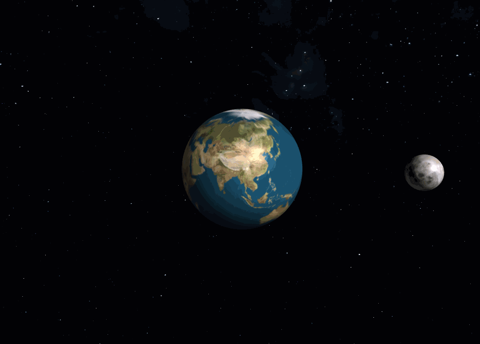
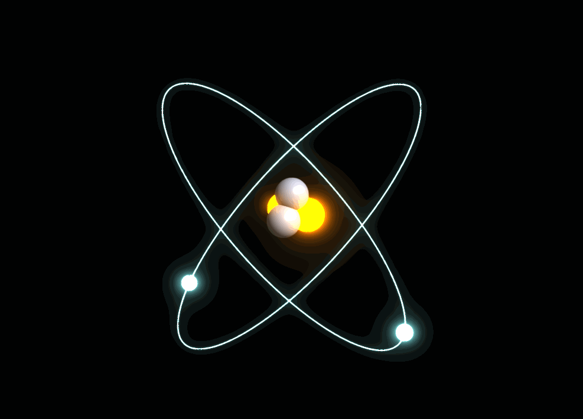
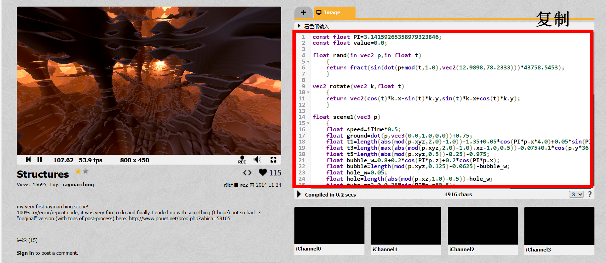

动画
==========================

目前 **Glass Engine** 暂不支持骨骼动画，现有的动画有两种形式：变化的各种参数和 Shadertoy 纹理。其中变化的参数可通过 ``QTimer`` 推动，并在回调函数中改变任意参数；Shadertoy 纹理可以通过编写 `Shadertoy <https://shadertoy.com/>`_ 格式的 Shader 将任意纹理设置为动态效果。

变化的参数
~~~~~~~~~~~~~~~~~~~~

你可以在 ``QTimer`` 的回调函数中改变前面章节介绍过的任何参数，以此来达到动画的效果。下面我们通过两个例子来直观感受一下如何使用变化的参数制作动画：

例子：地月系动画
>>>>>>>>>>>>>>>>>>>>

我们可以改变 :ref:`label_transform` 参数来实现地球自转，月球绕地球旋转的动画效果：

::

	from glass_engine import *
	from glass_engine.Geometries import *

	from PyQt6.QtCore import QTimer

	scene, camera, _, _ = SceneRoam(add_floor=False)
	scene.skydome = "https://www.solarsystemscope.com/textures/download/2k_stars_milky_way.jpg"

	earth = Sphere()
	earth.material.diffuse_map = "https://www.solarsystemscope.com/textures/download/2k_earth_daymap.jpg"
	scene.add(earth)

	moon = Sphere(radius=0.3)
	moon.position.x = 3
	moon.material.diffuse_map = "https://www.solarsystemscope.com/textures/download/2k_moon.jpg"

	moon_node = SceneNode()
	moon_node.add_child(moon)

	scene.add(moon_node)

	def timer_event():
	    earth.yaw += 3
	    moon_node.yaw += 1
	    camera.screen.update()

	timer = QTimer()
	timer.timeout.connect(timer_event)
	timer.start(20)

	camera.screen.show()

则能得到如图 1 所示的效果：

   图 1. 地月系动画效果

例子：氦原子动画
>>>>>>>>>>>>>>>>>>>>>>>>

与地月系动画类似，我们可以通过改变 :ref:`label_transform` 参数制作原子核的核外电子绕原子核运动的简单动画：

::

	from glass_engine import *
	from glass_engine.Geometries import *
	from PyQt6.QtCore import QTimer

	import math

	scene, camera, light = ModelView()
	light.generate_shadows = False

	# 计算核子位置
	sqrt_6 = math.sqrt(6)
	sqrt_2 = math.sqrt(2)
	sqrt_3 = math.sqrt(3)
	nucleon_positions = \
	[
	    0.1*glm.normalize(glm.vec3( 2/3*sqrt_2, 0, -1/3)), # 0
	    0.1*glm.normalize(glm.vec3( -sqrt_2/3, sqrt_6/3, -1/3)), # 1
	    0.1*glm.normalize(glm.vec3( -sqrt_2/3,   -sqrt_6/3, -1/3)), # 2
	    0.1*glm.normalize(glm.vec3( 0,    0,   1)), # 3
	]

	# 组装 He 原子
	He_atom = SceneNode()

	# 添加两个质子
	proton1 = Sphere(radius=0.1, color=10*glm.vec3( 0.77, 0.38, 0 ))
	proton1.material.shading_model = None
	proton1.position = nucleon_positions[0]
	He_atom.add_child(proton1)

	proton2 = Sphere(radius=0.1, color=10*glm.vec3( 0.77, 0.38, 0 ))
	proton2.material.shading_model = None
	proton2.position = nucleon_positions[1]
	He_atom.add_child(proton2)

	# 添加两个中子
	neutron1 = Sphere(radius=0.1, color=glm.vec3( 0.71, 0.77, 0.89 ))
	neutron1.position = nucleon_positions[2]
	He_atom.add_child(neutron1)

	neutron2 = Sphere(radius=0.1, color=glm.vec3( 0.71, 0.77, 0.89 ))
	neutron2.position = nucleon_positions[3]
	He_atom.add_child(neutron2)

	# 添加两个电子
	electron = Sphere(radius=0.05, color=10*glm.vec3(0.4, 0.7, 0.7))
	electron.material.shading_model = None
	electron.position.x = 1

	electron_orbit = Circle(radius=1, color=10*glm.vec3(0.4, 0.7, 0.7), line_width=1)
	electron_orbit.material.shading_model = None

	electron1_base_node = SceneNode()
	electron1_base_node.roll = -45
	electron1_base_node.add_child(electron_orbit)
	electron1_node = SceneNode()
	electron1_base_node.add_child(electron1_node)
	electron1_node.add_child(electron)
	He_atom.add_child(electron1_base_node)

	electron2_base_node = SceneNode()
	electron2_base_node.roll = -135
	electron2_base_node.add_child(electron_orbit)
	electron2_node = SceneNode()
	electron2_base_node.add_child(electron2_node)
	electron2_node.add_child(electron)
	He_atom.add_child(electron2_base_node)

	scene.add(He_atom)

	def electron_rotate():
	    electron1_node.yaw += 2
	    electron2_node.yaw -= 2
	    camera.screen.update()

	timer = QTimer()
	timer.timeout.connect(electron_rotate)
	timer.start(20)

	camera.screen.bloom = True
	camera.screen.FXAA = True
	camera.screen.show()

运行上述代码，则能够得到图 2 所示效果：

   图 2. 氦原子动画效果

.. _label_shadertory:

Shadertoy 动态纹理
~~~~~~~~~~~~~~~~~~~~

在 **Glass Engine** 中，所有纹理除了可以设置为静态图片，还可设置为 `Shadertoy <https://shadertoy.com/>`_ 格式的动态纹理。该类型纹理可从 `Shadertoy <https://shadertoy.com/>`_ 网站直接下载代码，方法为：

1. 打开 `Shadertoy <https://shadertoy.com/>`_ 网站，找到你喜欢的动态 Shader，打开并复制右侧红框中的代码，如图 3 所示：

   图 3. 打开 Shadertoy 复制代码
   
2. 将代码粘贴到任意一个文本文件中，保存并重命名为你想要的名字，例如 test.glsl
3. 将你保存的文件路径赋值给任意一处接受静态图片的参数，例如：material.emission_map

下面代码将一个 `Shadertoy <https://shadertoy.com/>`_ 纹理设置为 Box 的自发光贴图：

::

	from glass_engine import *
	from glass_engine.Geometries import *

	scene, camera, _, _ = SceneRoam()

	box = Box(Lx=2, Ly=2, Lz=2)
	box.position.z = 1
	box.material.emission_map = "test.glsl"
	box.material.shading_model = Material.ShadingModel.Unlit

	scene.add(box)

	camera.screen.show()

能够得到如图 4 所示结果：

.. figure:: images/box.gif
   :align: center
   :width: 500px

   图 4. 将 Shadertoy 动态纹理设置为 Box 的自发光贴图

除了从 Shadertoy 网站下载已有的 Shader，你也可以按照 Shadertoy 的 `编写规则 <https://www.shadertoy.com/howto>`_ 编写自己的动态 Shader 并设置为任意的纹理。