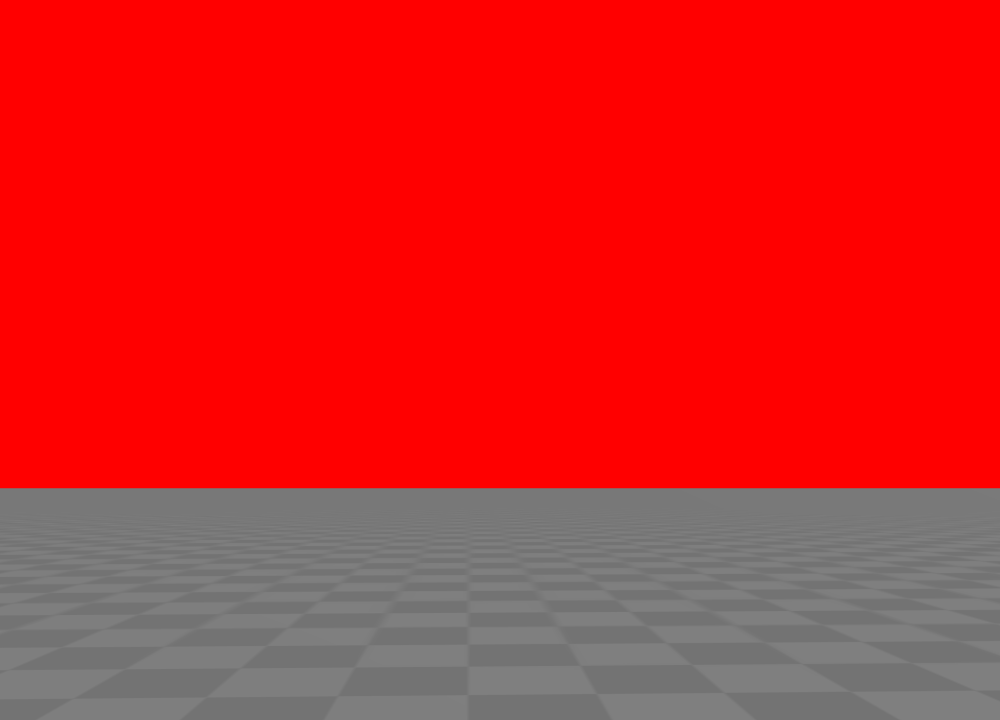
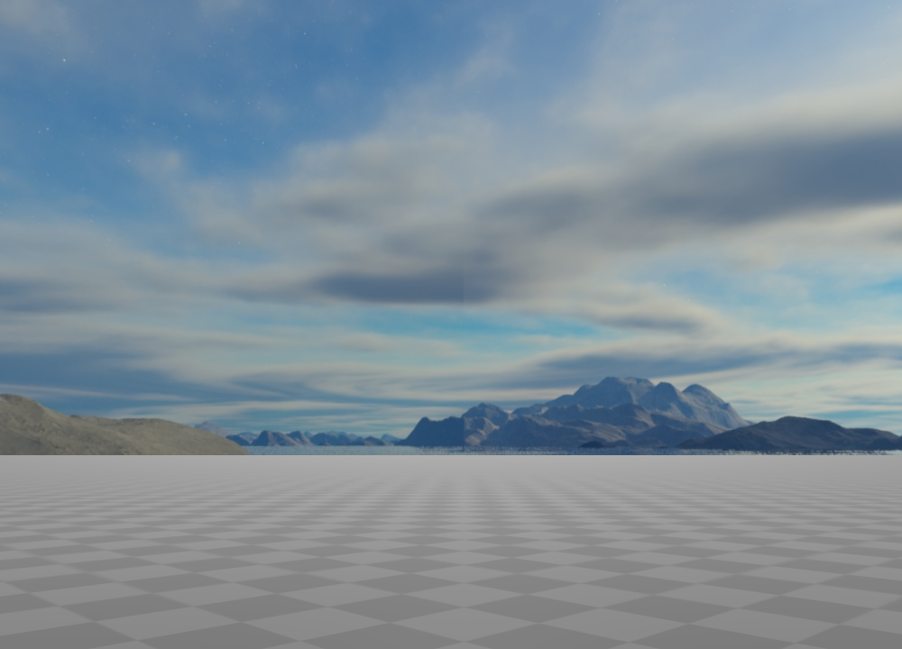
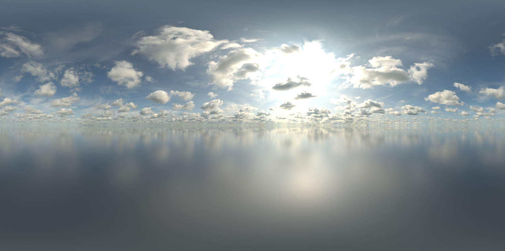
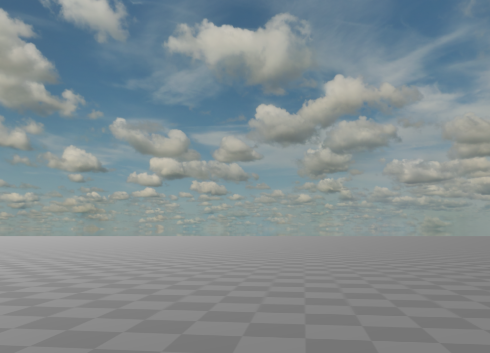

背景
==================

默认情况下，**Glass Engine** 显示的 3D 画面背景是黑色的，这一节我们将讲解如何给其添加背景色，或者随视角旋转的全景图。

背景色
~~~~~~~~~~~~~~~~~~~~

.. highlight:: python3

添加背景色十分简单，通过设置场景对象 ``scene`` 的 ``background.color`` 属性即可完成背景色的设置，其接受的类型可以是 ``glm.vec3`` 或 ``glm.vec4``，代表 rgb 颜色或 rgba 颜色。例如，下列代码将创建一个红色背景的场景：

::

    from glass_engine import *

    scene, camera, light, floor = SceneRoam() # 创建基本场景
    scene.background.color = glm.vec3(1, 0, 0) # 将屏幕背景设置为红色
    camera.screen.show() # 相机屏幕显示渲染结果

运行以上代码，你将得到如图 1 所示界面：

   图 1. 设置背景为红色

.. _label_skybox:

天空盒
~~~~~~~~~~~~~~~~~~~~

**天空盒** 是一种通过一个巨大的立方体包裹整个场景，进而制造沉浸感全景效果的技术。你需要指定立方体六个面的图片来构造一个完整的天空盒，如图 2 所示。

.. figure:: images/cubemaps_skybox.png
   :alt: 天空盒示意
   :align: center
   :width: 500px

   图 2. 天空盒示意图

在 **Glass Engine** 中，你可以通过设置 ``scene.skybox`` 的 ``front, back, left, right, top, bottom`` 六个属性来设置立方体六个面的图片，如以下代码所示。

::

    scene.skybox.front = "front.png"
    scene.skybox.back = "back.png"
    scene.skybox.left = "left.png"
    scene.skybox.right = "right.png"
    scene.skybox.top = "top.png"
    scene.skybox.bottom = "bottom.png"

天空盒的图片资源很难找见，在这里仅给出一个 `示例资源 <https://learnopengl-cn.github.io/data/skybox.rar>`_ 供下载。并使用如下代码将其设置为场景的天空盒：

::

	from glass_engine import *

	scene, camera, light, floor = SceneRoam()
	scene.skybox.front = "front.jpg"
	scene.skybox.back = "back.jpg"
	scene.skybox.left = "left.jpg"
	scene.skybox.right = "right.jpg"
	scene.skybox.top = "top.jpg"
	scene.skybox.bottom = "bottom.jpg"

	camera.screen.show()

运行可得到如图 3 所示结果：

   图 3. 添加了天空盒的场景

.. _label_skydome:

天空穹顶
~~~~~~~~~~~~~~~~~~~~

与天空盒不同，**天空穹顶** 通过一张图片即可完成创建。它通过将一张图片包括在一个巨大的球体表面来创建全景效果。你可以通过如下代码来设置天空穹顶：

::

	scene.skydome = "user_image.png"

你可以从这两个网站下载到大量免费的高质量 **天空穹顶** 贴图。

* https://polyhaven.com/hdris
* https://www.textures.com/browse/hdr-spheres/114552

例如，我下载了一张天空穹顶图片 `sunflowers_puresky_4k.exr <https://polyhaven.com/a/sunflowers_puresky>`_  如图 4 所示：

   图 4. 一张优质的天空穹顶图片

并用如下代码将其设置为场景的天空穹顶：

::

	from glass_engine import *

	scene, camera, light, floor = SceneRoam()
	scene.skydome = "sunflowers_puresky_4k.exr"

	camera.screen.show()

运行可得到如图 5 所示结果：

   图 5. 添加了天空穹顶的场景

一般情况下，你下载到的天空穹顶图片大多是 .exr 格式或 .hdr 格式，不用担心，在 **Glass Engine** 中可以直接使用。另外，天空穹顶图片还可以直接从网址加载：

::

   from glass_engine import *

   scene, camera, light, floor = SceneRoam()
   scene.skydome = "https://dl.polyhaven.org/file/ph-assets/HDRIs/extra/Tonemapped%20JPG/sunflowers_puresky.jpg"

   camera.screen.show()

事实上，在 **Glass Engine** 中，所有接收图片路径字符串的参数或属性，均可传入一个有效的图片网址。