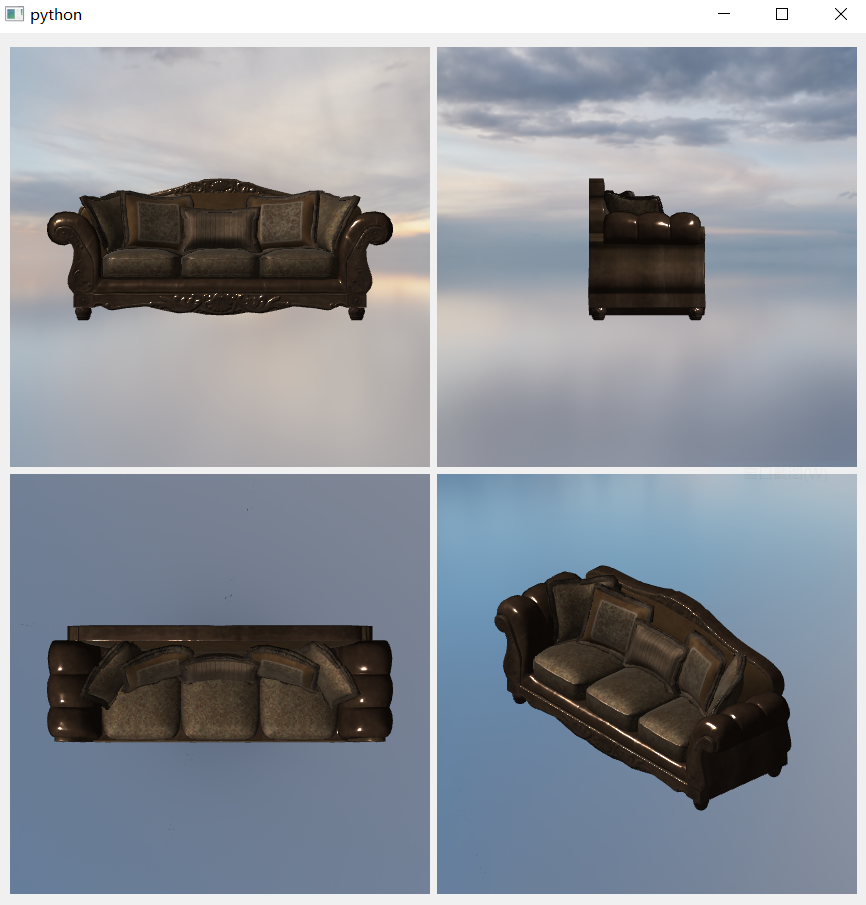

.. _label_camera:

相机
======================

在 **Glass Engine** 中，显示的 3D 画面均为相机看到的内容，必须有相机，才能有 3D 画面。进行渲染必须创建相机并添加到场景中，方法为：

::

	scene = Scene()
	camera = Camera()
	scene.add(camera)

或者通过以下方法自动创建场景、相机、光源、地板，这样相机就已经添加到场景中了。

::

	scene, camera, light, floor = SceneRoam()
	# scene, camera, light = ModelView()

基础属性与方法
~~~~~~~~~~~~~~~~~

相机对象 ``camera`` 的属性 ``screen`` 就是 3D 视口，其为 GUI 控件。由于目前仅支持 PyQt，因此 ``camera.screen`` 就是一个 ``QWidget``，可布局到 Qt 界面的任何位置。``camera.screen`` 中显示的即为相机看到的内容。除此之外，相机对象还拥有以下可读写属性：

- ``lens : Camera.Lens``：相机镜头，其中有一些参数供 :ref:`label_DOF` 和 :ref:`label_Explosure` 的 :ref:`label_PPEs` 使用；
- ``projection_mode : Camera.ProjectionMode``：投影模式，包括下列枚举值：
	- ``Camera.ProjectionMode.Perspective``：透视投影模式，适合观察场景
	- ``Camera.ProjectionMode.Orthographic``：正交投影模式，适合观察单个模型
- ``fov : float``：视场角，仅在透视投影模式下有用，单位为度，默认为 45 度；
- ``near : float``：近平面距离，单位为米，默认为 0.1 米；
- ``far : float``：远平面距离，单位为米，默认为 100 米；
- ``height : float``：视场高度，仅在正交投影模式下有用，单位为米，默认为 3 米左右，与宽度联动，保持宽高比为屏幕宽高比不变；
- ``width : float``：视场宽度，仅在正交投影模式下有用，单位为米，默认为 4 米左右，与高度联动，保持宽高比为屏幕宽高比不变；

下面是一些只读属性用于获取相机相关信息：

- ``scene : Scene``：获取相机所在的场景；
- ``abs_position : glm.vec3``：获取相机的世界坐标位置；
- ``abs_orientation : glm.quat``：获取相机的绝对姿态。

除了控制相机的性质外，相机对象还提供一些坐标转换方法，包括：

- ``project(world_coord:glm.vec3)->glm.vec4``：将某点的世界坐标投影为标准设备坐标（含透视项）；
- ``project3(world_coord:glm.vec3)->glm.vec3``：将某点的世界坐标投影为标准设备坐标；
- ``world_to_view(world_coord:glm.vec3)->glm.vec3``：将某点的世界坐标转化为观察空间坐标；
- ``view_to_world(view_coord:glm.vec3)->glm.vec3``：将某点的观察空间坐标转化为世界坐标；
- ``world_dir_to_view(world_dir:glm.vec3)->glm.vec3``：将向量的世界坐标转化为观察空间坐标；
- ``view_dir_to_world(view_dir:glm.vec3)->glm.vec3``：将向量的观察空间坐标转化为世界坐标；
- ``view_to_NDC(view_coord:glm.vec3)->glm.vec4``：将观察空间坐标投影为标准设备坐标（含透视项）；
- ``screen_to_view_dir(screen_pos:glm.vec2)->glm.vec3``：获取屏幕坐标（左上角为 (0, 0)，单位为像素）对应的射线的观察空间坐标，射线起点为 (0, 0, 0)，指向返回值方向；
- ``screen_to_view_dir(screen_pos:glm.vec2)->glm.vec3``：获取屏幕坐标对应的射线的世界坐标，射线起点为 ``camera.abs_position``，指向返回值方向。

.. _label_take_photo:

照相与录像
~~~~~~~~~~~~~~~~~

在 **Glass Engine** 中，相机不仅能将看到的内容显示到 ``screen`` 上，还可将看到的内容拍照到图片，或录像到视频，也就是对 3D 视口进行截图与录屏。照相与录像的方法为：

- ``camera.take_photo(save_path:str=None, viewport:tuple[int]=None)->np.ndarray``：
	- ``save_path:str``：截图文件路径，若没有指定，则不保存文件只返回内存图像
	- ``viewport:tuple[int]``：截图视口位置和尺寸，在 screen 中左下角坐标为 (0, 0)，右上角为 (scree_width, screen_height)，单位为像素，``viewport`` 格式为 ``(x_start, y_start, width, height)``，若不指定，则对整个 3D 视口截屏
	- ``return : np.ndarray``：截取的内存图像
- ``camera.record_video(save_path:str, viewport:tuple[int]=None, fps:float=None)->VideoRecorder``：
	- ``save_path:str``：录屏文件路径，必须指定，其后缀名只能是 .mp4 或 .avi
	- ``viewport:tuple[int]``：录屏视口位置和尺寸，若不指定，则对整个 3D 视口录屏
	- ``fps:float``：录屏帧率，若不指定，则使用当前渲染帧率为视频帧率
	- ``return : VideoRecorder``：用一个变量接受返回值，并在你想停止录像的时候在其上调用 ``stop`` 函数

.. _label_multi_cameras:

多相机
~~~~~~~~~~~~~~~~~

在 **Glass Engine** 中支持多相机多视口嵌入到同一个界面程序中，这多个相机可以处于同一个场景中，是对该场景从不同角度的观察结果，也可以处于不同的场景中。使用方法很简单，只需在场景中多添加几个相机即可。例如，下面采用 4 个相机同时显示一个模型的主视图、左视图、俯视图、3D 交互图，并将 4 个相机的屏幕布局到一个界面程序中：

::

	from glass_engine import *
	from glass_engine.Manipulators import *
	from glass_engine.Lights import *

	from PyQt6.QtWidgets import QApplication, QDialog, QHBoxLayout, QVBoxLayout
	from PyQt6.QtCore import Qt

	app = QApplication([])

	scene = Scene()
	scene.skydome = "industrial_sunset_puresky_4k.exr"

	# 添加模型
	model = Model("sofa_03_4k.gltf")
	model["root"].pitch = 90
	model.position.z = -0.5
	scene.add(model)

	# 添加光源
	light = DirLight()
	light.yaw = -45
	light.pitch = -45
	light.generate_shadows = False
	scene.add(light)

	# 主视图相机
	camera_main = Camera(Camera.ProjectionMode.Orthographic)
	camera_main.screen.manipulator = None # 禁用交互
	camera_main.position.y = -5
	scene.add(camera_main)

	# 左视图相机
	camera_left = Camera(Camera.ProjectionMode.Orthographic)
	camera_left.screen.manipulator = None # 禁用交互
	camera_left.position.x = -5
	camera_left.yaw = -90
	scene.add(camera_left)

	# 俯视图相机
	camera_over = Camera(Camera.ProjectionMode.Orthographic)
	camera_over.screen.manipulator = None # 禁用交互
	camera_over.position.z = 5
	camera_over.pitch = -90
	scene.add(camera_over)

	# 交互视图相机
	camera_inter = Camera(Camera.ProjectionMode.Orthographic)
	camera_inter.screen.manipulator = ModelViewManipulator(distance=5, azimuth=45, elevation=45)
	scene.add(camera_inter)

	# 布局 Qt 界面
	dialog = QDialog()
	dialog.setWindowFlags(Qt.WindowType.WindowMinMaxButtonsHint | Qt.WindowType.WindowCloseButtonHint)

	# 第一行
	hlayout_up = QHBoxLayout()
	hlayout_up.setContentsMargins(0, 0, 0, 0)
	hlayout_up.addWidget(camera_main.screen)
	hlayout_up.addWidget(camera_left.screen)

	# 第二行
	hlayout_down = QHBoxLayout()
	hlayout_down.setContentsMargins(0, 0, 0, 0)
	hlayout_down.addWidget(camera_over.screen)
	hlayout_down.addWidget(camera_inter.screen)

	# 垂直布局
	vlayout_all = QVBoxLayout()
	vlayout_all.addLayout(hlayout_up)
	vlayout_all.addLayout(hlayout_down)

	dialog.setLayout(vlayout_all)
	dialog.resize(700, 700)
	dialog.show()

	app.exec()

会得到图 1 所示结果：

   图 1. 多相机多视口观察场景

其中的 :ref:`label_skydome` 图片和沙发 :ref:`label_model` 均下载自 https://polyhaven.com
