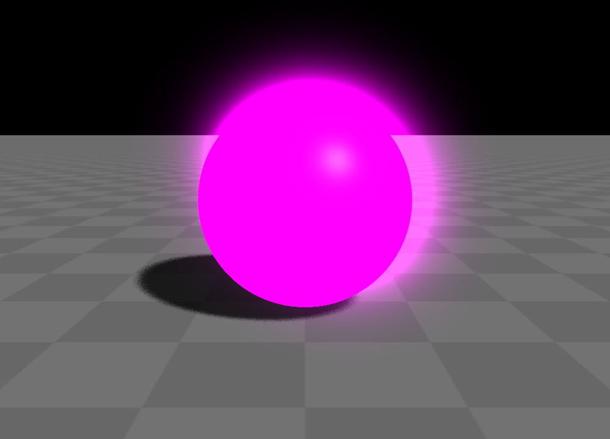

颜色与渲染提示
=============================

改变网格的视觉效果有三种方式：颜色、渲染提示和材质，在本章将讲解颜色和渲染提示。在本章中，将使用一个简单的示例来进行讲解：

::

	from glass_engine import *
	from glass_engine.Geometries import *

	scene, camera, _, _ = SceneRoam()

	sphere = Sphere()
	sphere.position.z = 1
	scene.add(sphere)

	camera.screen.show()

这段代码能够产生如图 1 所示的效果：

	图 1. 基准效果

下文中的例子均基于这段代码对 ``sphere`` 这个网格对象进行修改。

颜色
~~~~~~~~~~~~~~~~~~~~~~~

每个网格对象都含有 ``color`` 属性，用于控制网格的颜色。这里的颜色为网格的本体颜色，而材质可理解为网格穿的衣服。默认情况下，材质完全透明，则网格的视觉效果完全取决于网格的本体颜色。直接设置 ``color`` 为某个颜色值即可改变物体颜色。可以使用 ``glm.vec3`` 将 ``color`` 设置为三通道颜色，例如通过如下代码将颜色设置为紫色：

::

	sphere.color = glm.vec3(1, 0, 1) # 设置颜色为 3 通道值

可得到如图 2 所示的效果：

	图 2. 设置颜色为紫色

还可以使用 ``glm.vec4`` 将 ``color`` 设置为四通道颜色，其中的 alpha 通道代表不透明度。例如通过如下代码将颜色设置为半透明的紫色：

::

	sphere.color = glm.vec4(1, 0, 1, 0.4) # 设置 alpha 通道值小于 1

这将得到如图 3 所示的效果：

	图 3. 设置颜色为半透明的紫色

常规颜色分量值应该限制在 0 到 1 之间，如果要营造自发光效果，则应该让颜色值大于 1，并开启 :ref:`label_bloom` 效果。例如，可以通过如下代码设置物体颜色为自发光的紫色：

::

	sphere.color = glm.vec3(10, 0, 10) # 设置颜色值大于 1
	camera.screen.bloom = True # 开启泛光

能够得到图 4 所示结果：

   图 4. 设置颜色值大于 1 并开启泛光

与 ``color`` 相同，``back_color`` 可用于设置网格的背面颜色，当你没有设置 ``back_color`` 时，背面颜色与正面颜色相同。

另外，你还可以在构建网格时指定 ``color`` 与 ``back_color`` 参数去修改网格的颜色，例如下面代码将设置网格的正面为红色，背面为绿色

::

	sphere = Sphere(color=glm.vec3(1,0,0), back_color=glm.vec3(0,1,0))

渲染提示
~~~~~~~~~~~~~~~~~~~~~~~

渲染提示同样能一定程度的修改网格的视觉效果，可通过网格对象的 ``render_hints`` 属性访问到该网格的渲染提示，下面是一些常用的渲染提示设置：

- ``render_hints.polygon_mode``：多边形渲染模式，默认为 ``GL.GL_FILL`` 以填充模式渲染，可设置为如下枚举值：
	- ``GL.GL_FILL``：以填充方式渲染
	- ``GL.GL_LINE``：以线框模式渲染
	- ``GL.GL_POINT``：以点模式渲染
- ``render_hints.line_width : int``：以线框模式渲染时，指定线宽，单位为像素，默认为 1；
- ``render_hints.point_size : int``：以点模式渲染时，指定点大小，单位为像素，默认为 1；
- ``render_hints.depth_test : bool``：是否进行深度测试，默认为 ``True``，如果想要该网格永远不被遮挡，可将其设置为 ``False``；
- ``render_hints.cull_face``：面剔除方式，默认为 ``None`` 不剔除，可设置为如下枚举值：
	- ``GL.GL_BACK``：背面剔除
	- ``GL.GL_FRONT``：正面剔除
	- ``GL.GL_FRONT_AND_BACK``：双面剔除
	- ``None``：不剔除

	如果一个网格是封闭的并且没有机会钻进该网格进行观察的话，可将面剔除方式设置为 ``GL.GL_BACK`` 以提高渲染效率。

例如，通过如下代码改变网格的多边形渲染模式：

::

	# sphere.render_hints.polygon_mode = GL.GL_FILL # 以填充模式渲染
	sphere.render_hints.polygon_mode = GL.GL_LINE # 以线框模式渲染
	# sphere.render_hints.polygon_mode = GL.GL_POINT # 以点模式渲染

可以得到图 5 所示的三种渲染效果：

   图 5. 填充模式、线框模式和点模式渲染