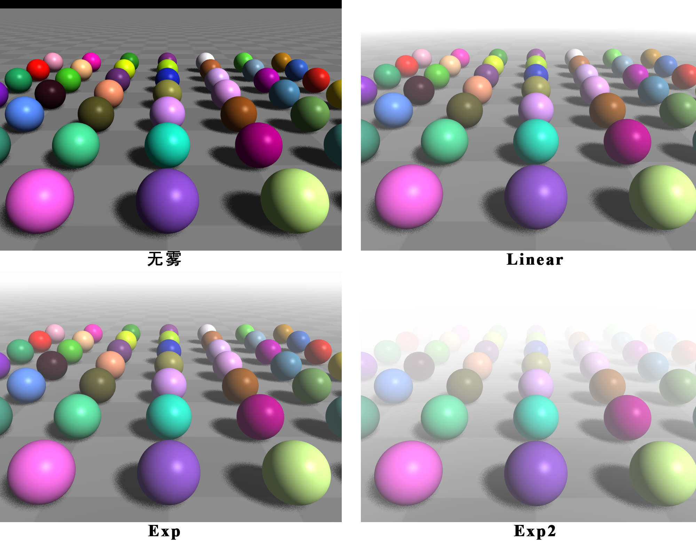
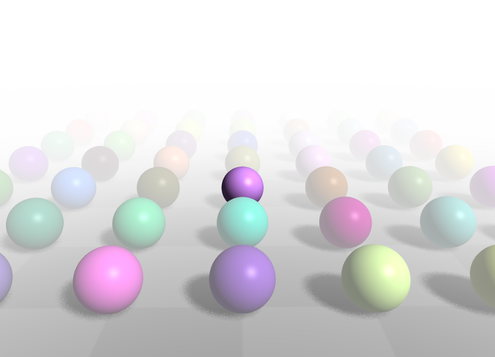

.. _label_fog:

雾
================

从现实生活中所拍摄的照片中可以看出，越远的景物越朦胧，这是因为有大气消散，如图 1 所示：

   图 1. 景物越远越朦胧（图片来自网络）

在 **Glass Engine** 中可以通过 **雾** 来实现这一效果，只需设置场景对象 ``scene`` 的 ``fog`` 属性即可，只需将其密度设为非零值即可 ``scene.fog.density = 0.05``。同时，你还可以设置雾模式 ``scene.fog.mode`` 为下列三个枚举之一：

- ``Fog.Mode.Linear``: 线性衰减雾效果
- ``Fog.Mode.Exp``: 指数衰减雾效果
- ``Fog.Mode.Exp2``: 平方指数衰减雾效果

下面创建一个简单场景并添加雾观察一下效果：

::

	from glass_engine import *
	from glass_engine.Geometries import *
	from glass_engine.Lights import *

	import random

	scene, camera, light, _ = SceneRoam()
	scene.fog.density = 0.05 # 设置雾密度
	scene.fog.mode = Fog.Mode.Exp
	# scene.fog.mode = Fog.Mode.Linear
	# scene.fog.mode = Fog.Mode.Exp2

	random.seed(0)
	for i in range(7):
	    for j in range(7):
	        sphere = Sphere(0.25)
	        sphere.color = glm.vec3(random.random(), random.random(), random.random())
	        sphere.position.x = j - 3
	        sphere.position.y = i - 3
	        sphere.position.z = 0.25
	        scene.add(sphere)

	camera.screen.show()

分别使用雾模式为 ``Linear, Exp, Exp2``，你会看到图 2 所示结果：

   图 2. 不同雾模式的场景

场景中的雾对象所有可供设置的属性包括：

- ``color:glm.vec3``: 雾颜色，默认为白色 ``glm.vec3(1, 1, 1)``；
- ``mode:Fog.Mode``: 雾模式，下列值之一 ``[Fog.Mode.Linear, Fog.Mode.Exp, Fog.Mode.Exp2]``，默认为 ``Fog.Mode.Exp``；
- ``extinction_density:float``: 消尽密度，应当在 0 到 1 范围内，越大雾越浓；
- ``inscattering_density:float``: 内散射密度，应当在 0 到 1 范围内，越大雾越浓；
- ``density:float``: 一旦设置了 ``density``，便会将 ``extinction_density`` 和 ``inscattering_density`` 设置为相同值。

最后，你可以设置某个网格的材质是否受到雾的影响，通过 ``Material.fog:bool`` 属性即可完成设置。例如，将场景中一个球设置为不受雾影响：

::

	from glass_engine import *
	from glass_engine.Geometries import *
	from glass_engine.Lights import *

	import random

	scene, camera, light, _ = SceneRoam()
	scene.fog.density = 0.05 # 设置雾密度
	scene.fog.mode = Fog.Mode.Exp
	# scene.fog.mode = Fog.Mode.Linear
	# scene.fog.mode = Fog.Mode.Exp2

	random.seed(0)
	for i in range(7):
	    for j in range(7):
	        sphere = Sphere(0.25)
	        if i == 2 and j == 3:
                sphere.material.fog = False

	        sphere.color = glm.vec3(random.random(), random.random(), random.random())
	        sphere.position.x = j - 3
	        sphere.position.y = i - 3
	        sphere.position.z = 0.25
	        scene.add(sphere)

	camera.screen.show()

得到图 3 所示场景：

   图 3. 中间一个球不受雾影响

可以看到，中间紫色的小球没有收到浓雾的影响。