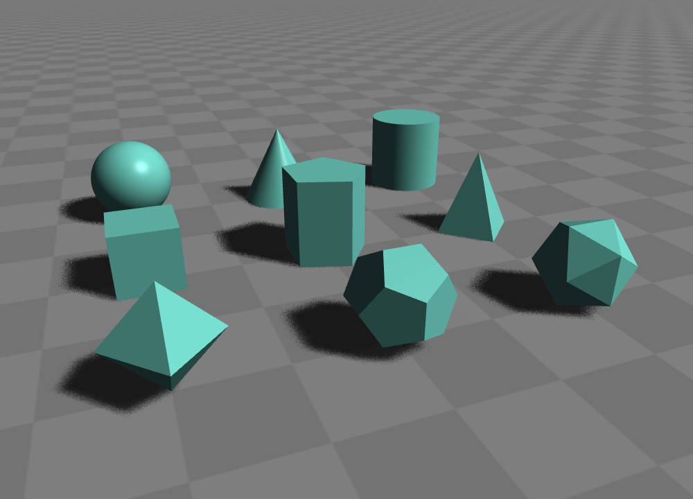
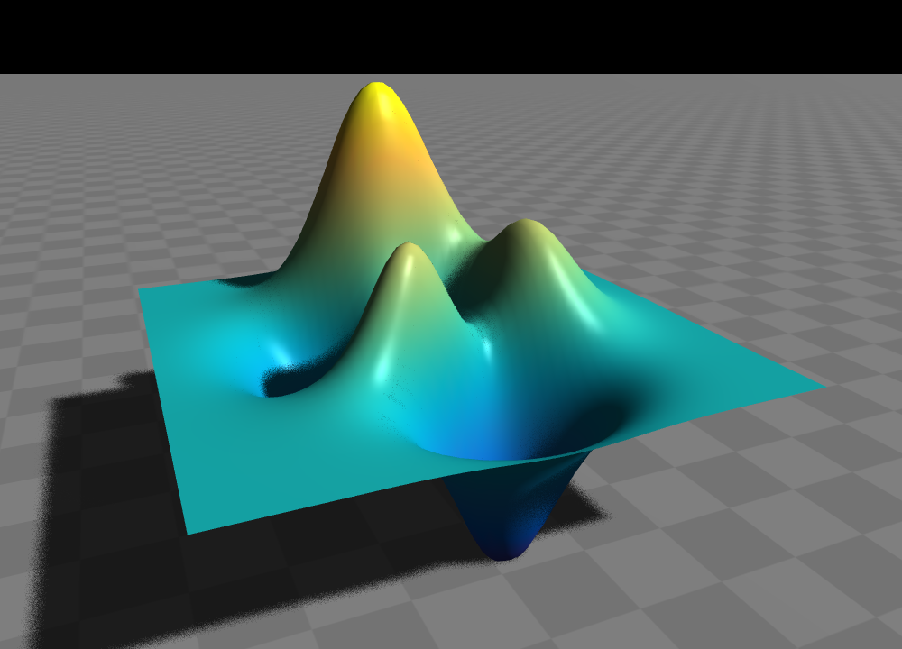
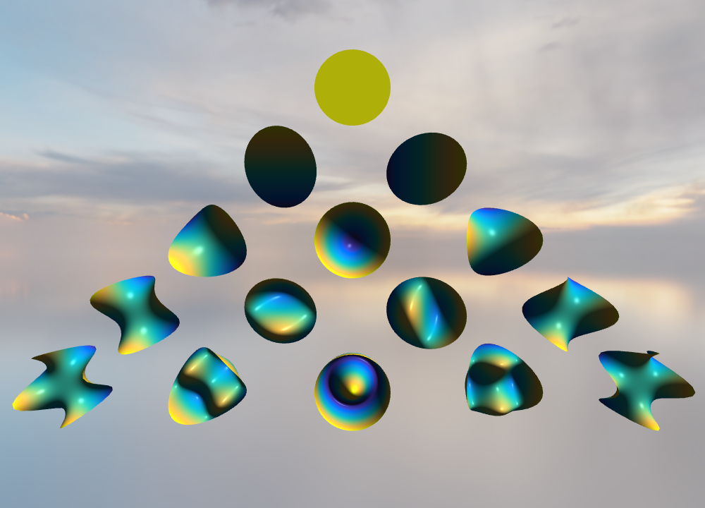
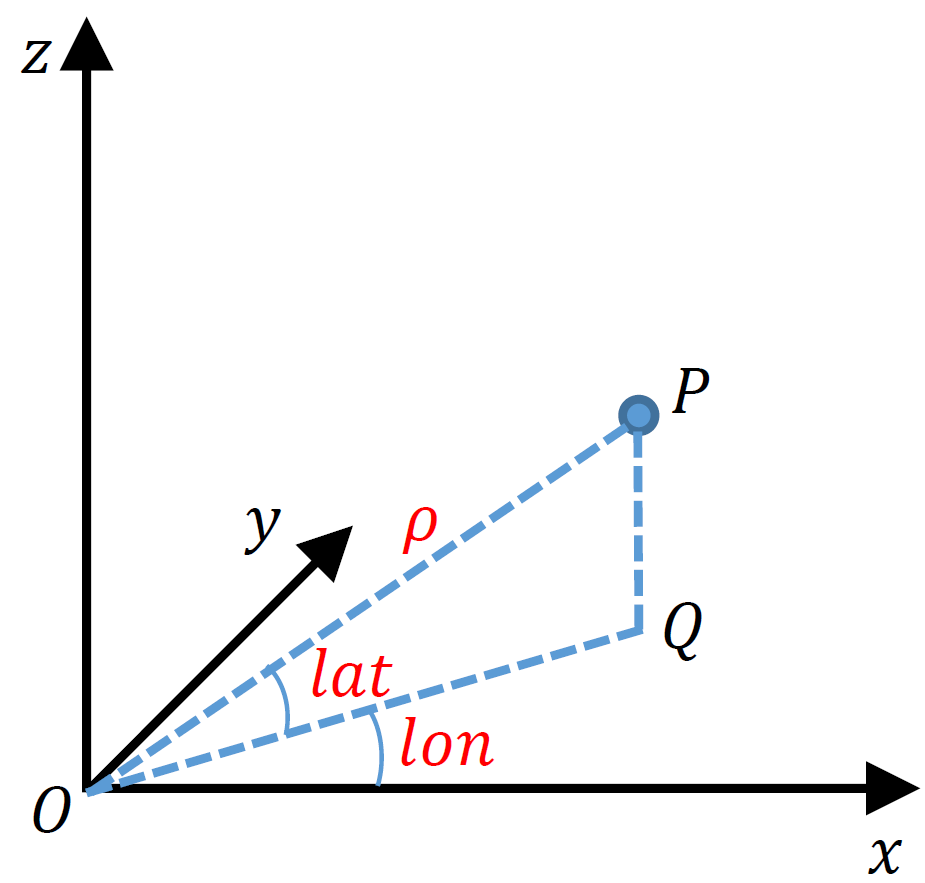
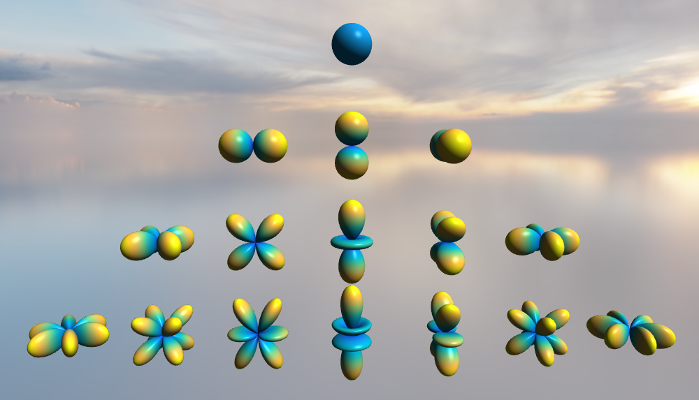
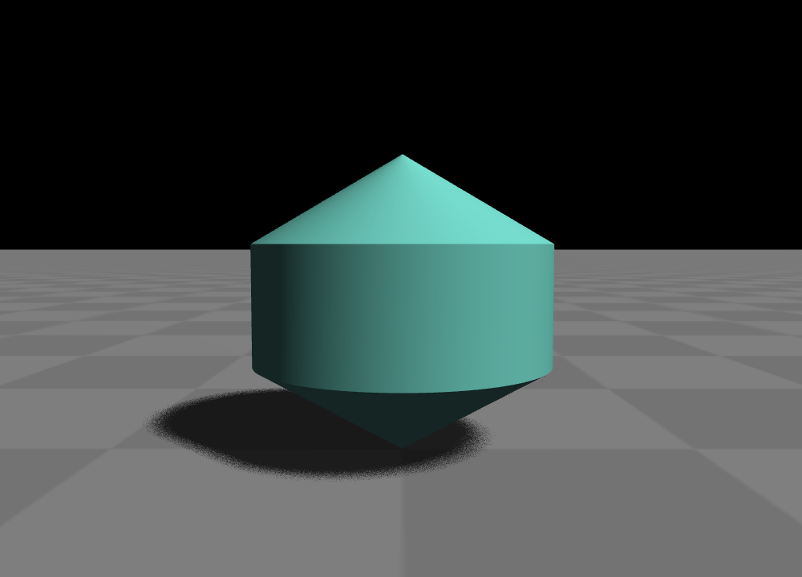
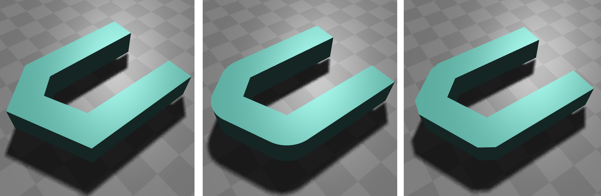
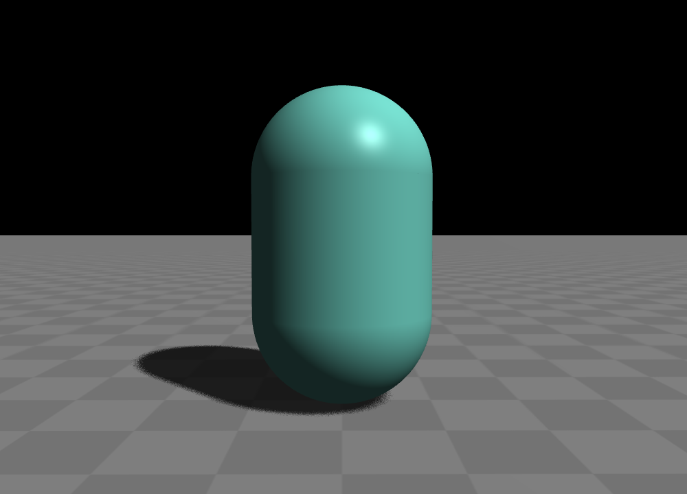
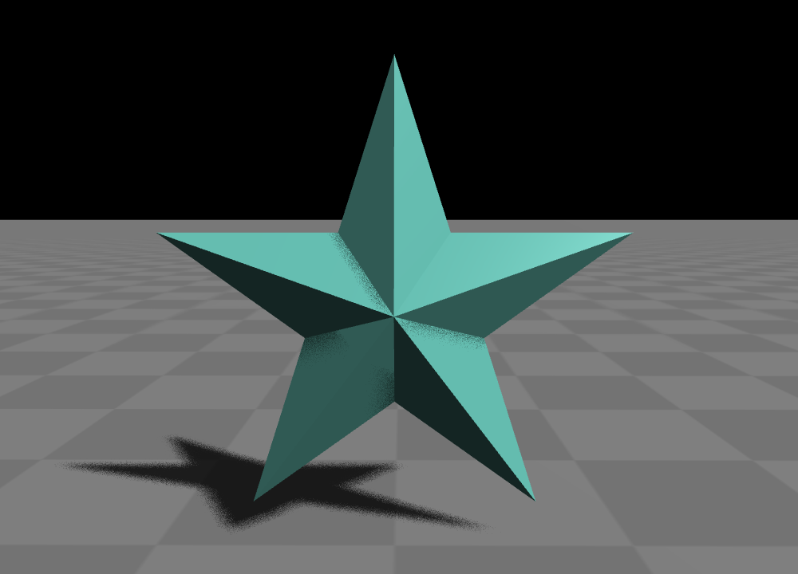

.. _label_geometries:

基本几何体
==================

基本几何体
~~~~~~~~~~~~~~~~~~~

**Glass Engine** 内置 40 多种基本几何体，均定义在 ``glass_engine.Geometries`` 模块中，这些几何体均继承自 ``Mesh`` 类，而 ``Mesh`` 类直接继承自 ``SceneNode`` 类，所以，它们可以像任何场景节点一样做任意的 :ref:`label_transform`。下列表格列出了 **Glass Engine** 内置的所有基本几何体的预览信息。表中出现的所有英文名均为 ``glass_engine.Geometries`` 中定义的类名，大多数可直接无参数构造使用。

.. role:: raw-html(raw)
    :format: html

.. list-table:: 基本几何体预览表
   :align: center
   :header-rows: 1

   * - 点线面
     - 多面体
     - 曲面体
     - 特殊几何体
   * - .. figure:: images/Point.png
			:align: center
			:width: 100px

			点 Point
     - .. figure:: images/Box.png
			:align: center
			:width: 100px

			长方体 Box
     - .. figure:: images/Sphere.png
			:align: center
			:width: 100px

			球体 :raw-html:` ` Sphere, Icosphere
     - .. figure:: images/FSurf.png
			:align: center
			:width: 100px

			直角坐标函数曲面 :raw-html:` ` FSurf
   * - .. figure:: images/Points.png
			:align: center
			:width: 100px

			多点 Points
     - .. figure:: images/Prism.png
			:align: center
			:width: 100px

			棱柱 Prism
     - .. figure:: images/Cylinder.png
			:align: center
			:width: 100px

			圆柱 Cylinder
     - .. figure:: images/CylindricalFSurf.png
			:align: center
			:width: 100px

			柱坐标函数曲面 :raw-html:` ` CylindricalFSurf
   * - .. figure:: images/Polyline.png
			:align: center
			:width: 100px

			线 Polyline
     - .. figure:: images/Pyramid.png
			:align: center
			:width: 100px

			棱锥 Pyramid
     - .. figure:: images/Cone.png
			:align: center
			:width: 100px

			圆锥 Cone
     - .. figure:: images/SphericalFSurf.png
			:align: center
			:width: 100px

			球坐标函数曲面 :raw-html:` ` SphericalFSurf
   * - .. figure:: images/Circle.png
			:align: center
			:width: 100px

			圆 :raw-html:` ` Circle
     - .. figure:: images/PyramidTrustum.png
			:align: center
			:width: 100px

			棱台 :raw-html:` ` PyramidTrustum
     - .. figure:: images/ConeTrustum.png
			:align: center
			:width: 100px

			圆台 :raw-html:` ` ConeTrustum
     - .. figure:: images/_CoordSys.png
			:align: center
			:width: 100px

			坐标系 CoordSys
   * - .. figure:: images/RectFace.png
			:align: center
			:width: 100px

			矩形面 :raw-html:` ` RectFace
     - .. figure:: images/PrismSide.png
			:align: center
			:width: 100px

			棱柱侧面 :raw-html:` ` PrismSide
     - .. figure:: images/CylinderSide.png
			:align: center
			:width: 100px

			圆柱侧面 :raw-html:` ` CylinderSide
     - .. figure:: images/Floor.png
			:align: center
			:width: 100px

			地板 Floor
   * - .. figure:: images/RPolygonFace.png
			:align: center
			:width: 100px

			正多边形面 :raw-html:` ` RPolygonFace
     - .. figure:: images/PyramidSide.png
			:align: center
			:width: 100px

			棱锥侧面 :raw-html:` ` PyramidSide
     - .. figure:: images/ConeSide.png
			:align: center
			:width: 100px

			圆锥侧面 :raw-html:` ` ConeSide
     - .. figure:: images/Rotator.png
			:align: center
			:width: 100px

			旋转体 Rotator
   * - .. figure:: images/HollowRPolygonFace.png
			:align: center
			:width: 100px

			空心正多边形面 :raw-html:` ` 
			HollowRPolygonFace
     - .. figure:: images/PyramidTrustumSide.png
			:align: center
			:width: 100px

			棱台侧面 :raw-html:` ` PyramidTrustumSide
     - .. figure:: images/ConeTrustumSide.png
			:align: center
			:width: 100px

			圆台侧面 :raw-html:` ` ConeTrustumSide
     - .. figure:: images/Extruder.png
			:align: center
			:width: 100px

			拉伸体 Extruder
   * - .. figure:: images/CircleFace.png
			:align: center
			:width: 100px

			圆面 CircleFace
     - .. figure:: images/Tetrahedron.png
			:align: center
			:width: 100px

			正四面体 :raw-html:` ` Tetrahedron
     - .. figure:: images/SphericalCap.png
			:align: center
			:width: 100px

			球冠 SphericalCap
     - 
   * - .. figure:: images/TorusFace.png
			:align: center
			:width: 100px

			圆环面 TorusFace
     - .. figure:: images/Hexahedron.png
			:align: center
			:width: 100px

			正六面体 :raw-html:` ` Hexahedron
     - .. figure:: images/SphericalCapTop.png
			:align: center
			:width: 100px

			球冠顶面 :raw-html:` ` SphericalCapTop
     - 
   * - .. figure:: images/EllipseFace.png
			:align: center
			:width: 100px

			椭圆面 EllipseFace
     - .. figure:: images/Octahedron.png
			:align: center
			:width: 100px

			正八面体 :raw-html:` ` Octahedron
     - .. figure:: images/Torus.png
			:align: center
			:width: 100px

			球环 Torus
     - 
   * - 
     - .. figure:: images/Dodecahedron.png
			:align: center
			:width: 100px

			正十二面体 :raw-html:` ` Dodecahedron
     - .. figure:: images/TrefoilKnot.png
			:align: center
			:width: 100px

			三叶扭结 TrefoilKnot
     - 
   * - 
     - .. figure:: images/Icosahedron.png
			:align: center
			:width: 100px

			正二十面体 :raw-html:` ` Icosahedron
     - 
     - 

例子：常见几何体绘制
>>>>>>>>>>>>>>>>>>>>>>>>>>

我们可以通过如下代码在场景中添加几个常见的基本几何体：

.. highlight:: python3

::

	from glass_engine import *
	from glass_engine.Geometries import *

	scene, camera, light, floor = SceneRoam()

	geoms = \
	[
	    Sphere(radius=0.5)    , Cone(radius=0.5)        , Cylinder(radius=0.5),
	    Box(Lx=0.7)           , Prism(radius=0.5)       , Pyramid(radius=0.5),
	    Octahedron(radius=0.5), Dodecahedron(radius=0.5), Icosahedron(radius=0.5)
	]

	for i in range(len(geoms)):
	    geoms[i].position.x = 2*(i % 3 - 1)
	    geoms[i].position.y = 2*(1 - i // 3)
	    geoms[i].position.z -= geoms[i].z_min
	    scene.add(geoms[i])

	camera.screen.show()

运行以上代码将得到图 1 所示结果：

   图 1. 添加了一些基本几何体的场景

在上述代码中，添加的 9 个几何体分别为：球体(``Sphere``)、圆锥(``Cone``)、圆柱(``Cylinder``)、长方体(``Box``)、棱柱(``Prism``)、棱锥(``Pyramid``)、正八面体(``Octahedron``)、正十二面体(``Dodecahedron``)、正二十面体(``Icosahedron``)。

每一个几何体都有一些细节参数，例如你可以分别设置长方体(``Box``)每条边的长度。每一个几何体的参数可以通过 API 手册[to-do] 查看。

直角坐标函数曲面
~~~~~~~~~~~~~~~~~~~~

在 **Glass Engine** 中，可使用类 ``FSurf`` 来绘制直角坐标系下的函数曲面。我们知道，在直角坐标系下，一个二元函数 :math:`z = f(x, y)` 可以表示一个曲面。在 **Glass Engine** 中，只需给出函数 :math:`z = f(x, y)` 的定义并传入 ``FSurf(func, x_range, y_range)`` 的 ``func`` 参数即可。同时，还可以通过指定 ``x_range=[start, stop], y_range=[start, top]`` 给出 :math:`x, y` 的取值范围。``x_range, y_range`` 的默认值为 ``[-3, 3]``。事实上，``FSurf`` 还含有大量其他参数，请参见[to-do]，在此不一一介绍。

例子：一个多峰函数可视化
>>>>>>>>>>>>>>>>>>>>>>>>>>>>>

我们知道，在 MATLAB 中一个常用的绘图测试函数为 ``peaks``，其定义如下：

.. math::
	\begin{aligned}
		z & = f(x, y) \\
		  & = (1-x)^2\,\mathrm{e}^{-x^2 - (y+1)^2} - \frac{10}{3}\left(\frac{x}{5} - x^3 - y^5\right)\,\mathrm{e}^{-x^2 - y^2} - \frac{1}{9}\,\mathrm{e}^{-(x+1)^2 - y^2}
	\end{aligned}

为了绘制它，我们只需定义出 ``peaks`` 函数：

::

    import numpy as np

    def peaks(x, y):
        return (1-x)**2 * np.exp(-(x**2) - (y+1)**2) \
               - 10/3*(x/5 - x**3 - y**5)*np.exp(-x**2-y**2) \
               - 1/9*np.exp(-(x+1)**2 - y**2)

然后将其传给 ``FSurf`` 类即可：

::

    from glass_engine import *
    from glass_engine.Geometries import *

    scene, camera, _, _ = SceneRoam()

    peaks_surf = FSurf(peaks)
    peaks_surf.position.z = 2
    scene.add(peaks_surf)

    camera.screen.show()

上述代码在场景中添加了 peaks 函数曲面，运行它，你将得到如图 2 所示效果：

	图 2. peaks 函数曲面

柱坐标函数曲面
~~~~~~~~~~~~~~~~~~~~

在 **Glass Engine** 中，可使用类 ``CylindricalFSurf`` 来绘制柱坐标函数曲面。我们知道，在柱坐标系下的二元函数，仍能表示一个曲面。在柱坐标系下，定位一个点所用的坐标为 :math:`(r, \theta, z)`，其中：

- :math:`r`: 为极径在 :math:`xy` 平面上投影的长度；
- :math:`\theta`: 为极径在 :math:`xy` 平面上的投影与 :math:`x` 轴的夹角（从 :math:`x` 轴在投影顺时针为正，逆时针为负）；
- :math:`z`: 为定位点到 :math:`xy` 平面的有向距离（在 :math:`xy` 平面上方为正，下方为负）。

如图 3 所示：

.. figure:: images/cylindrical_func.png
	:align: center
	:width: 250px

	图 3. 柱坐标系下的坐标含义

图中：

- :math:`OP` 为极径；
- :math:`OQ` 为 :math:`OP` 在 :math:`xy` 平面上的投影；
- :math:`r = |OQ|`；
- :math:`\theta` 为 :math:`x` 轴转到 :math:`OQ` 的角；
- :math:`z` 为 :math:`QP` 的有向长度。

而柱坐标函数则表示为 :math:`z = h(r, \theta)`。绘制柱坐标函数曲面只需给出函数 :math:`z = h(r, \theta)` 的定义 ``func``，并传入 ``CylindricalFSurf(func, r_range, theta_range)`` 即可。还可通过 ``r_range=[start, stop], theta_range=[start, stop]`` 参数更改 :math:`r` 和 :math:`\theta` 的取值范围。事实上，``CylindricalFSurf`` 还含有大量其他参数，请参见[to-do]，在此不一一介绍。

.. note::
	定义函数 ``func(r, theta)`` 时的 ``theta`` 参数需要以弧度为单位。同样地，``CylindricalFSurf`` 参数中的 ``theta_range`` 也需要以弧度为单位。

例子：泽尼克多项式可视化
>>>>>>>>>>>>>>>>>>>>>>>>>>>>>

我们知道，泽尼克多项式在光学领域中具有重要应用。泽尼克多项式是定义在单位圆上的柱坐标函数空间的一组正交基，任何定义在单位圆上的柱坐标函数都可表示为泽尼克多项式级数的形式，所以，我们选择绘制这一典型的柱坐标基础函数来了解类 ``CylindricalFSurf`` 的使用。泽尼克多项式的柱坐标表示形式 :math:`Z_n^m(r, \theta)` 为：

.. math::
	Z_n^m(r, \theta) = 
	\left\{
	\begin{aligned}
	& C_n^m(r)\cos(m\theta) , & 0 \leqslant m \leqslant n \\
	& C_n^m(r)\sin(m\theta) , & -n \leqslant m < 0
	\end{aligned}
	\right.

其中，

.. math::
	C_n^m(r) = \sum_{k=0}^{\lfloor\frac{n-m}{2}\rfloor}(-1)^k\dfrac{(n-k)!}{k!\left(\lfloor\frac{n+m}{2}\rfloor-k\right)!\left(\lfloor\frac{n-m}{2}\rfloor-k\right)!}r^{n-2k}

在 ``glass_engine.algorithm`` 中已经定义了泽尼克多项式取值函数，为 ``Zernike_eval(n, m, r, theta)``，我们可以直接调用 ``CylindricalFSurf`` 进行绘制，接下来我们将不同的 :math:`n, m` 所代表的泽尼克多项式绘制到场景中：

::

    from glass_engine import *
    from glass_engine.algorithm import Zernike_eval
    from glass_engine.Geometries import *
    import glass_engine

    from functools import partial
    import os

    scene, camera, dir_light, _ = SceneRoam(add_floor=False)
    camera.position.z = 0
    camera.position.y = -15
    camera.pitch = 0
    dir_light.generate_shadows = False

    N = 5
    for n in range(N):
        for m in range(-n, n+1, 2):
            Zernike_surf = CylindricalFSurf(partial(Zernike_eval, n, m), r_range=[0, 1])
            Zernike_surf.position = glm.vec3(2*m, 0, N-2*n)
            Zernike_surf.pitch = 90
            scene.add(Zernike_surf)

    module_folder = os.path.dirname(glass_engine.__file__)
    scene.skydome = module_folder + "/Demos/assets/skydomes/puresky.exr"
    camera.screen.show()

上述代码在场景中添加了 :math:`n \leqslant 5` 的所有泽尼克多项式的图像，运行它，你将得到如图 4 所示结果。

	图 4. 泽尼克多项式可视化结果

球坐标函数曲面
~~~~~~~~~~~~~~~~~~~~

在 **Glass Engine** 中，可使用类 ``SphericalFSurf`` 来绘制球坐标函数曲面。我们知道，在球坐标系下的二元函数，仍能表示一个曲面。在球坐标系下，定位一个点所用的坐标为 :math:`(lon, lat, \rho)` 用球坐标函数表示曲面时，其中：

- :math:`lon`: 为经度，极径在 :math:`xy` 平面上的投影与 :math:`x` 轴的夹角（从 :math:`x` 轴到投影逆时针为正，顺时针为负）
- :math:`lat`: 为纬度，极径与 :math:`xy` 平面的夹角（从 :math:`xy` 平面到极径向上为正，向下为负）
- :math:`\rho`: 为极径长度

如图 5 所示：

	图 5. 球坐标系下的坐标含义

图中：

- :math:`OP` 为极径；
- :math:`OQ` 为 :math:`OP` 在 :math:`xy` 平面上的投影；
- :math:`lon` 为 :math:`OQ` 与 :math:`x` 轴的夹角；
- :math:`lat` 为 :math:`OP` 与 :math:`OQ` 的夹角；
- :math:`\rho = |OP|`。

而球坐标函数则表示为 :math:`\rho = f(lon, lat)`。绘制球坐标函数曲面只需给出函数 :math:`\rho = f(lon, lat)` 的定义，并传入 ``SphericalFSurf(func, lon_range, lat_range)`` 的 ``func`` 参数即可。还可通过 ``lon_range=[start, span], lat_range=[start, span]`` 参数更改 :math:`lon` 和 :math:`lat` 的取值范围。事实上，``SphericalFSurf`` 还含有大量其他参数，请参见[to-do]，在此不一一介绍。

.. note::
	定义函数 ``func(lon, lat)`` 时的 ``lon, lat`` 参数需要以弧度为单位。同样地，``SphericalFSurf`` 参数中的 ``lon_range, lat_range`` 也需要以弧度为单位。

例子：球谐函数可视化
>>>>>>>>>>>>>>>>>>>>>>>>>>>>>

我们知道，球谐函数是一种经典的球坐标函数，在量子力学领域和计算机图形学中的基于图像的光照 (Image Based Lighting, IBL) 中被广泛应用。球谐函数是球坐标函数空间的一组正交基，任何球坐标函数都可表示为球谐函数级数展开的形式，所以，我们选择绘制球坐标函数空间最基础的函数作为例子来了解类 ``SphericalFSurf`` 的使用。球谐函数 :math:`Y_{l,m}(\theta, \varphi)` 定义如下：

.. math::
	Y_{l,m}(\theta, \varphi) = A_{l,m}\,P_l^m (\cos\theta)\,\mathrm{e}^{\mathrm{i}m\varphi}~~~(l \geqslant 0, -l \leqslant m \leqslant l)

其中，

.. math::
	\begin{aligned}
		A_{l,m} & = (-1)^m\sqrt{\dfrac{2l+1}{4\pi}\dfrac{(l + m)!}{(l - m)!}}\\
		P_l^m (x) & = 
		\left\{
		\begin{aligned}
			& (1 - x^2)^{\frac{m}{2}}\sum_{k=0}^{\lfloor\frac{l - m}{2}\rfloor}(-1)^k\dfrac{(2(l - k))!}{2^l k! (l-k)! (l - 2k - m)!}x^{l-2k-m} & , m \geqslant 0 \\
			& (-1)^{m}\dfrac{(l+m)!}{(l-m)!}P_l^{-m} (x) & , m < 0
		\end{aligned}
		\right.
	\end{aligned}

其中 :math:`\varphi` 表示经度，等同于 :math:`lon` 参数，:math:`\theta` 表示极径与 :math:`z` 轴夹角，等效于 :math:`\frac{\pi}{2}-lat`。注意到，:math:`Y_{l,m}(\theta, \varphi)` 为一个复数，在绘制其所表示的曲面时，通常绘制下面这个实函数：

.. math::
	\rho(\theta, \varphi) = 
	\left\{
	\begin{aligned}
		& \sqrt{2} \left|\mathrm{real}\left(Y_{l,m}(\theta, \varphi)\right)\right| & ,~~m > 0\\
		& \sqrt{2} \left|\mathrm{imag}\left(Y_{l,m}(\theta, \varphi)\right)\right| & ,~~m < 0\\
		& \left|\mathrm{real}\left(Y_{l,m}(\theta, \varphi)\right)\right| & ,~~m = 0
	\end{aligned}
	\right.

在 **Glass Engine** 中，已经给出了 :math:`Y_{l,m}(\theta, \varphi)` 的定义，即 ``glass_engine.algorithm`` 中的函数 ``spherical_harmonics_eval(l, m, theta, phi)``，其将返回一个复数，下面我们只需定义出 :math:`\rho(lon, lat)` 即可：

::

    import numpy as np
    from glass_engine.algorithm import spherical_harmonics_eval

    def SH_func(l, m, lon, lat):
        theta = np.pi/2 - lat
        phi = lon

        result = spherical_harmonics_eval(l, m, theta, phi)
        if m > 0:
            return np.sqrt(2) * np.abs(result.real)
        elif m < 0:
            return np.sqrt(2) * np.abs(result.imag)
        else:
            return np.abs(result.real)

接下来我们将给出不同的 :math:`l, m` 的组合，并将对应的球谐函数曲面全部绘制到场景中：

::

	from glass_engine import *
	from glass_engine.Geometries import *
	import glass_engine

	import math
	import os
	from functools import partial

	scene, camera, dir_light, _ = SceneRoam(add_floor=False)
	dir_light.generate_shadows = False

	N = 4
	for l in range(N):
	    for m in range(-l, l+1):
	        SH_surf = SphericalFSurf(partial(SH_func, l, m))
	        SH_surf.yaw = -90
	        SH_surf.position = glm.vec3(math.sqrt(2) * m, 0, N/1.5-math.sqrt(2) * n)
	        scene.add(SH_surf)

	module_folder = os.path.dirname(glass_engine.__file__)
	scene.skydome = module_folder + "/Demos/assets/skydomes/puresky.exr"
	camera.screen.show()

上述代码在场景中添加了 :math:`l \leqslant 4` 的所有球谐函数的图像，运行它，你将得到如图 6 所示结果。

	图 6. 球谐函数可视化结果

旋转体
~~~~~~~~~~~~~~~~~~~~

在 **Glass Engine** 中，可使用 ``Rotator`` 来创建旋转体。只需给出旋转截面的定义和旋转轴，即可创建旋转体。具体方法如下：

::

	# 定义截面点集
	section = [glm.vec3(0), glm.vec3(0.5, 0, 0.3), glm.vec3(0.5, 0, 0.7), glm.vec3(0, 0, 1)]
	axis_start = glm.vec3(0) # 定义旋转轴起点
	axis_end = glm.vec3(0, 0, 1) # 定义旋转轴终点
	model = Rotator(section, axis_start, axis_end) # 创建旋转体

将上面创建的旋转体绘制到图中即可得到如图 7 所示结果：

	图 7. 测试的旋转体

拉伸体
~~~~~~~~~~~~~~~~~~~~

在 **Glass Engine** 中，可以通过 ``Extruder`` 来创建拉伸体，拉伸体即为一个截面延某个路径拉伸所形成的几何体。只需给出截面点集和路径点集即可轻松地创建拉伸体。具体方法为：

::

	# 定义一个正方形截面
	section = \
	[
		glm.vec3(-0.5, 0, -0.5),
		glm.vec3(0.5, 0, -0.5),
		glm.vec3(0.5, 0, 0.5),
		glm.vec3(-0.5, 0, 0.5),
		glm.vec3(-0.5, 0, -0.5)
	]

	# 定义一个任意路径
	path = \
	[
		glm.vec3(0, 0, 0.5),
		glm.vec3(0, 4, 0.5),
		glm.vec3(2, 5, 0.5),
		glm.vec3(3, 4, 0.5),
		glm.vec3(3, 0, 0.5)
	]

	model = Extruder(section, path, join_type=Extruder.JoinStyle.MiterJoin)
	# model = Extruder(section, path, join_type=Extruder.JoinStyle.RoundJoin)
	# model = Extruder(section, path, join_type=Extruder.JoinStyle.BevelJoin)

可以看到，在上述代码中不仅设置了截面 ``section`` 和路径 ``path`` 参数，还设置了 ``join_type`` 参数。``join_type`` 参数含义为连接处的连接类型，有三个枚举值可选，分别为 ``MiterJoin, RoundJoin, BevelJoin``。这三种连接方式分别绘制在图中即为图 8 所示：

	图 8. join_type 依次为 MiterJoin、RoundJoin、BevelJoin

几何体组合
~~~~~~~~~~~~~~~~~~~~~~~

你可以通过组合来构建更加复杂的几何体。方法为往某个几何体上挂载子几何体，或者多个几何体挂载到一个抽象的场景节点上以实现几何体的组合。例如，我们可以将两个球体和一个圆柱组合为一个胶囊：

::

	from glass_engine import *
	from glass_engine.Geometries import *

	scene, camera, _, _ = SceneRoam()

	capsule = Cylinder(height=1.5) # 创建一个圆柱作为主体

	top_sphere = Sphere() # 顶部球盖
	top_sphere.position.z = 1.5 # 设置球盖相对于父节点的位置
	capsule.add_child(top_sphere) # 球盖添加为胶囊的子节点

	bottom_sphere = Sphere() # 底部球盖
	capsule.add_child(bottom_sphere) # 球盖添加为胶囊的子节点

	capsule.position.z = 1 # 将胶囊作为一个整体设置位置
	scene.add(capsule)

	camera.screen.show()

你将得到一个站立的胶囊，如图 9 所示。

	图 9. 一个圆柱和两个球体组合成的胶囊

.. _label_self_geo:

自定义几何体
~~~~~~~~~~~~~~~~~~~~~~~

有时可能我们需要更复杂的几何体，这是可以采用自定义几何体的方式。值得注意的是，我们应首先考虑拉伸体、旋转体、函数曲面、几何体组合能否满足我们的需求，你最后的选择才是自定义几何体。

自定义几何体需要自定义一个类，继承自 ``glass_engine.Mesh``，并重写其 ``build`` 方法。在 **Glass Engine** 中，所有可渲染物体均以三角网格构成，曲面也是如此，只不过曲面的三角网更密。所以我们自定义几何体就是自定义三角网。思考一下，要实现三角网的定义首先应该定义所有 **顶点**，定义完所有顶点后，我们需要定义哪三个点连接组成一个三角形。这个连接顺序称为 **索引**。总的来说，实现几何体的自定义只需要完成 **顶点** 和 **索引** 的定义即可。

具体方法为：自定义一个类并继承自 ``glass_engine.Mesh``，并重写其 ``build`` 方法。在 ``build`` 方法中为 ``self.vertices`` 和 ``self.indices`` 属性添加内容，即可完成几何体的自定义。例如，我们来定义一个五角星 ``Star``：

::

	from glass_engine import *
	from glass_engine.Geometries import *
	from glass import Vertex
	import math

	class Star(Mesh):

	    def __init__(self, radius:float=1, thickness:float=0.4):
	        Mesh.__init__(self)
	        self.__radius = radius
	        self.__thickness = thickness
	        self.start_building()

	    def build(self):
	        R = self.__radius # 长轴半径
	        r = R * math.sin(math.pi/10) / math.cos(math.pi/5) # 短轴半径
	        theta_shift = math.pi/5

	        # 上中心凸起点
	        self.vertices.append(Vertex(position=glm.vec3(0, 0, self.__thickness/2)))
	        # 索引为 0

	        # 下中心凸起点
	        self.vertices.append(Vertex(position=glm.vec3(0, 0, -self.__thickness/2)))
	        # 索引为 1

	        for i in range(5):
	            # 凸出角顶点
	            theta_outter = i/5 * 2*math.pi
	            pos_outter = glm.vec3()
	            pos_outter.x = -R*math.sin(theta_outter)
	            pos_outter.y =  R*math.cos(theta_outter)
	            pos_outter.z =  0

	            vertex_outter = Vertex(position=pos_outter)
	            index_outter = 2 + 2*i
	            index_outter_next = 2 + 2*(i + 1)
	            if i == 4:
	                index_outter_next = 2
	            self.vertices.append(vertex_outter)

	            # 内凹角顶点
	            theta_inner = theta_outter + theta_shift
	            pos_inner = glm.vec3()
	            pos_inner.x = -r*math.sin(theta_inner)
	            pos_inner.y =  r*math.cos(theta_inner)
	            pos_inner.z =  0

	            index_inner = 2 + 2*i + 1
	            vertex_inner = Vertex(position=pos_inner)
	            self.vertices.append(vertex_inner)

	            # 上表面覆盖的两个三角形
	            self.indices.append(glm.uvec3(0, index_outter, index_inner))
	            self.indices.append(glm.uvec3(0, index_inner, index_outter_next))

	            # 下表面覆盖的两个三角形
	            self.indices.append(glm.uvec3(1, index_outter, index_inner))
	            self.indices.append(glm.uvec3(1, index_inner, index_outter_next))

在上述代码中，我们首先定义了一个类 ``Start`` 继承自 ``Mesh``，并在其 ``__init__`` 方法中调用父类的 ``__init__``，并将五角星的几何参数赋值给成员变量。注意，在 ``__init__`` 方法结束时，需要调用 ``self.start_building()`` 已完成几何体的构建，请不要直接调用 ``self.build()``，因为在 ``build`` 之后 **Glass Engine** 还会添加一些额外信息，例如自动计算法向量等。

在 ``build`` 方法中，我们计算了顶点位置并通过 ``Vertex`` 创建顶点，随后将顶点添加到 ``self.vertices`` 中。你可以将 ``self.vertices`` 完全当做 ``list`` 使用，只不过其中只能容纳 ``Vertex`` 类型变量。

最后计算了三角形连接顺序，三角形连接顺序用三个整数表示，整数的含义为 ``self.vertices`` 中的第几个顶点，三个整数含义为这三个顶点将连接成一个三角形面。三个整数组合放入 ``glm.uvec3`` 的构造参数中作为一个三角形，并将这个三角形添加到 ``self.indices`` 中。你可以将 ``self.indices`` 完全当做 ``list`` 使用，只不过其中只能容纳 ``glm.uvec3`` 类型变量。

这样，我们就完成了五角星几何体 ``Start`` 的自定义，下面，让我们来显示它吧：

::

	scene, camera, light, floor = SceneRoam()

	star = Star()
	star.pitch = 90
	star.position.z = 1
	scene.add(star)

	camera.screen.show()

这段代码你应该很熟悉了，首先使用 ``SceneRoam`` 创建基础场景，然后用我们刚定义的 ``Start`` 创建对象、设置位置，并添加到场景中，最后将相机屏幕显示出来。运行上述代码，你将看到图 10 所示结果。

	图 10. 自定义的五角星几何体

如果你需要更复杂的几何体以至于自定义几何体会非常麻烦，那么你可以从 3D 建模软件中创建并保存为文件，或者从网上下载 3D 模型文件，然后使用 **Glass Engine** 加载。下一章我们将讲解 3D 模型的加载。