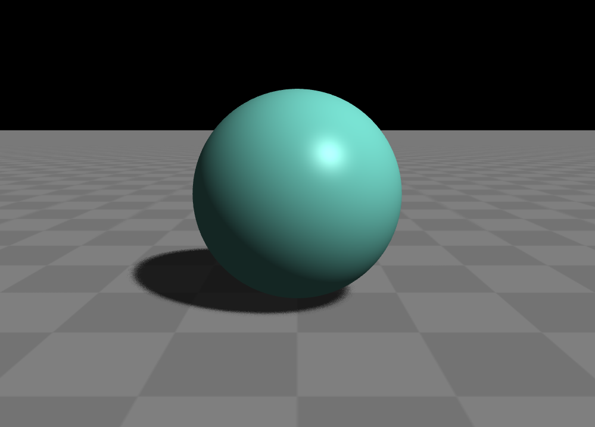

开始
====================

在目录页，我们已经通过一个简单的例子感受到了 **Glass Engine** 简洁的魅力，在这一节，我们将通过另一个稍微丰富的例子来助你上手 **Glass Engine** 开发。

基本工作流
~~~~~~~~~~~~~~~~~~~~

使用 **Glass Engine** 进行 3D 渲染的流程非常简单，如图 1 所示。

   图 1. 使用 **Glass Engine** 的基本工作流

这个工作流是非常符合人类直觉的。为什么这么说？想象一下，做 3D 渲染，无非就是显示人眼看到的物理世界对吧？那我们首先要有这个物理世界吧，所以我们需要先创建一个空场景。然而，空场景中什么也没有，显然，下一步应该添加一些有趣的物体。在真实的物理世界当中，只有物体没有光源是不是会漆黑一片什么也看不见，对吧？在 **Glass Engine** 中同样如此。因此下一步是添加光源。到此，场景就基本创建完毕了。但是，只有场景没有观察者场景创建的再丰富也是无意义的，因此我们至少往场景中添加一个观察值，在 **Glass Engine** 中，观察者就是相机。我们要显示的东西，就是相机观察到的东西。到此，**Glass Engine** 的基本工作流就结束了，如你所见，该流程是相当直观的。接下来我们将通过一个例子来具体了解该工作流如何实施。

简单例子
~~~~~~~~~~~~~~~~~~~~

在 Python 中，首先，你应该导入 **Glass Engine** 相关的库，为方便起见，我们将一次性导入 **Glass Engine** 的所有内容：

.. highlight:: python3

::

	from glass_engine import *
	from glass_engine.Geometries import *
	from glass_engine.Lights import *

如你所见，我们还导入了子模块 ``Geometries`` 和 ``Lights`` 中的所有内容，``Geometries`` 中包含了常见的基本几何体，以供 **添加物体** 步骤使用；``Lights`` 中包含了常见的光源，以供 **添加光源** 步骤使用。在 `基本几何体 <../geometries/geometries.html>`_ 和 `光源 <../lights/lights.html>`_ 章节我们将更加细致的讲解它们的用法，此处我们直接拿来用。

接下来是工作流的第一步，**创建空场景**。场景由 ``Scene`` 类定义，你只需用 ``Scene`` 创建对象即可：

::

	scene = Scene()

接下来是工作流的第二步，往场景中 **添加物体**。``Geometries`` 子模块中包含了大量基本几何体，我们在此仅使用球体 ``Sphere``，使用 ``Sphere`` 类创建对象 ``sphere``，并使用 ``scene.add`` 方法将对象添加到场景中：

::

	sphere = Sphere()
	scene.add(sphere)

为了好看，我们可以再往场景中添加一个地板：

::

	floor = Floor()
	scene.add(floor)

根据工作流程我们知道，下面应该 **添加光源** 了。在此，我们往场景中添加一个平行光源 ``DirLight``：

::

	light = DirLight()
	light.pitch = -45
	light.yaw = 45
	scene.add(light)

注意看，我们创建平行光源以后，还设置了它的俯仰角 ``pitch`` 和偏航角 ``yaw`` 。由于默认情况下 ``DirLight`` 是照向正前方的，为了让光从天上射下来，我们应该设置其向下俯 45 度，这正是 ``pitch`` 属性干的事。而 ``yaw`` 则设置了光方向左偏右偏的角度，这里则是设置光的方向左偏 45 度。对于 ``yaw, pitch, roll`` 更细致的讲解请参见 `空间变换 <../transform/transform.html>`_。

然后，我们应该 **创建相机**，并将相机添加到场景中：

::

	camera = Camera()
	camera.position.z = 1.7
	camera.position.y = -5
	camera.pitch = -15
	scene.add(camera)

注意看，我们创建相机后，进而设置了它的位置坐标，**Glass Engine** 中的坐标系是 x 轴朝右，y 轴朝前，z 轴朝上。因此，代码中设置的该位置表示高 1.7 米的位置，并向后退 5 米。对 ``pitch`` 的设置则表示向下俯视 15 度。在 `空间变换 <../transform/transform.html>`_ 一章我们将更详细的讲解坐标系统、位置、姿态等概念。

最后，应该将相机看到的内容 **显示** 出来。我们知道，在当今的物理世界中，相机往往就是手机或数码相机，而它们都有一个显示屏用于显示拍摄到的东西。类似的，在 **Glass Engine** 中，``Camera`` 对象含有一个 ``screen`` 属性，表示相机的显示屏，以后的描述则称之为相机屏幕。在程序中，``Camera.screen`` 本质上是一个 GUI 控件，由于 **Glass Engine** 目前仅支持 PyQt 窗口系统，因此目前 ``Camera.screen`` 就是一个 ``QWidget``，你可以将其布局到界面的任意位置。然而最简单的方式则是直接将其显示出来：

::

	camera.screen.show()

这样就完成了 **Glass Engine** 进行基本渲染的全部工作流。完整的代码如下：

::

	from glass_engine import *
	from glass_engine.Geometries import *
	from glass_engine.Lights import *

	# 1. 创建空场景
	scene = Scene()

	# 2. 添加物体
	sphere = Sphere()
	scene.add(sphere)

	floor = Floor()
	scene.add(floor)

	# 3. 添加光源
	light = DirLight()
	light.pitch = -45
	light.yaw = 45
	scene.add(light)

	# 4. 添加相机
	camera = Camera()
	camera.position.z = 1.7
	camera.position.y = -5
	camera.pitch = -15
	scene.add(camera)

	# 5. 显示相机屏幕内容
	camera.screen.show()

运行它，将得到图 2 所示结果：

   图 2. 一个简单场景

由于没有设置球体的位置，这个球则是一半在地板之下的。你可以自己尝试将球的位置设置到地板之上。

键鼠交互
~~~~~~~~~~~~~~~

和大部分游戏一样，你可以通过 :kbd:`W` :kbd:`A` :kbd:`S` :kbd:`D` :kbd:`E` :kbd:`C` 在场景中进行漫游，并通过鼠标控制视角。具体地，

- :kbd:`A`：相机向左移动，:kbd:`D`：相机向右移动；
- :kbd:`W`：相机向前移动，:kbd:`S`：相机向后移动；
- :kbd:`E`：相机向上移动，:kbd:`C`：相机向下移动；
- 鼠标右键拖拽：改变相机视角；
- 鼠标左键拖拽：在垂直与观察方向的平面内平移相机；
- 鼠标滚轮推动：向前推则放大视口，向后拉则缩小视口；
- 鼠标左侧前进键：提高键盘移动速度；
- 鼠标左侧后退键：降低键盘移动速度；
- :kbd:`R`：在实体模式、网格模式、点模式这三种显示模式下切换；
- :kbd:`F`：打印帧率和绘制调用次数。

如果你不满意这种键盘鼠标交互方式，`键鼠交互 <../manipulators/manipulators.html>`_ 则会教你如何切换不同的键鼠交互方式以及如何自定义交互模式

简化操作
~~~~~~~~~~~~~~~

从上面的代码中可以看出，无论你要渲染什么，有一些步骤是必然重复的，例如创建空场景、创建相机；还有一些步骤是渲染简单场景基本都会有的，例如添加地板、添加一个有较好方向的平行光、设置一个较好的相机位置。为了简化用户工作量，**Glass Engine** 将这些公共操作封装成了函数 ``SceneRoam``，使用方法为：

::

	from glass_engine import *

	scene, camera, dir_light, floor = SceneRoam()
	camera.screen.show()

``SceneRoam`` 可以给你创建一个基本场景：包含了相机、光源、地板，并合理的设置好了相机位置朝向、光方向。``SceneRoam`` 简化了大部分工作量，因此，在以后一些简单的例子中，都将使用 ``SceneRoam`` 来创建基本场景。

如果你只需要显示一个模型，并希望仅仅围绕这个模型进行详细的查看的话，可以使用另一个简化操作的函数 ``ModelView``，他将不添加地板，同时设置键盘鼠标交互模式为仅仅围绕物体旋转的模型预览模式，左键拖动旋转，右键拖动平移。例如这个例子：

::

	from glass_engine import *
	from glass_engine.Geometries import *

	scene, camera, dir_light = ModelView()

	sphere = Sphere()
	scene.add(sphere)

	camera.screen.show()

它将遵循的键鼠交互模式与场景漫游模式稍有不同，鼠标左键拖动是围绕物体旋转，右键拖动是平移相机。

本章带你入门后，下面的章节将更加全面的讲解一些基本概念。