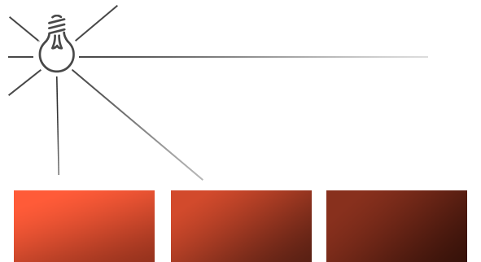

.. _label_lights:

光源
===================

**Glass Engine** 支持三种光源：平行光 (``DirLight``)、点光源 (``PointLight``) 和聚光 (``SpotLight``)。这三种光源都定义在 ``glass_engine.Lights`` 子模块中，可直接导入使用。``DirLight, PointLight, SpotLight`` 均为 ``SceneNode`` 的间接子类，因此可设置一切 ``SceneNode`` 支持的空间变换。这三种光源有一些共同的参数，分别为：

- ``color:glm.vec3``: 光源颜色，默认为白色（``glm.vec3(1, 1, 1)``）
- ``intensity:float``：光源亮度，默认为 1
- ``generate_shadows:bool``：光源是否产生阴影，默认为 ``Ture``
- ``rim_power:float``：光源的边缘光强度，默认为 0.3

这三种光源还有一些特有的参数，下面分别讲解。在以下讲解中，我们将在一个含有大量彩球的场景中测试各种光源的效果，该场景内容如下。

::

	from glass_engine import *
	from glass_engine.Geometries import *
	from glass_engine.Lights import *

	import random

	scene, camera, light, _ = SceneRoam()
	scene.remove(light)

	random.seed(0)
	for i in range(7):
	    for j in range(7):
	        sphere = Sphere(0.25)
	        sphere.color = glm.vec3(random.random(), random.random(), random.random())
	        sphere.position.x = j - 3
	        sphere.position.y = i - 3
	        sphere.position.z = 0.25
	        scene.add(sphere)

	camera.screen.show()

其运行结果如图 1 所示：

   图 1. 无光源场景

可以看到，由于没有光源，场景非常昏暗，几乎看不见物体。下面通过往场景中添加不同的光源以查看它们各自的效果。

.. _label_DirLight:

平行光
~~~~~~~~~~~~~~~~~~~~

在 **Glass Engine** 中，可以通过 ``DirLight`` 类创建平行光源对象并添加到场景中去。平行光中的每条光线是相互平行的，并且能够照亮全场，如图 2 所示。

.. figure:: images/dir_light.png
   :alt: 平行光示意图
   :align: center
   :width: 350px

   图 2. 平行光示意图

除了所有光源都共有的参数外，它没有任何特有参数。通过以下代码在场景中加入一个平行光源：

::

	dir_light = DirLight()
	dir_light.yaw = 45
	dir_light.pitch = -45
	scene.add(dir_light)

将其添加到上面的场景中，可以得到如图 3 所示的场景效果：

   图 3. 加入平行光的场景

.. _label_PointLight:

点光源
~~~~~~~~~~~~~~~~~~~~

在 **Glass Engine** 中，可以通过 ``PointLight`` 类创建点光源对象并添加到场景中去。点光源处于场景中的某一位置，它会朝着所有方向发光，并且光的强度会随着距离的增大而衰减，如图 4 所示。

   图 4. 点光源示意图

点光源有一些特有的参数用于控制衰减，包括：

- ``coverage:float``: 光照覆盖范围，单位为米，默认为 11 米
- ``K1:float``: 一次衰减系数，默认为 0.045。``K1`` 越大，衰减越快，与 ``coverage`` 直接相关并自动联动。
- ``K2:float``: 二次衰减系数，默认为 0.0075。``K2`` 越大，衰减越快，与 ``coverage`` 直接相关并自动联动。

其中衰减系数 :math:`F_{att}` 与 :math:`K_1, K_2` 的关系为：

.. math::
	F_{att} = \dfrac{1}{1 + K_1\,d + K_2\,d^2}

如果感觉通过控制 :math:`K_1, K_2` 来控制衰减不直观的话则可以直接使用 ``coverage`` 属性。

通过以下代码在场景中加入一个点光源：

::

	point_light = PointLight()
	point_light.position.z = 5
	scene.add(point_light)

我们在世界坐标原点正上方加入了一个点光源，可以得到如图 5 所示的场景效果：

   图 5. 加入点光源的场景

如果将镜头拉远，观察有光照的场景区域，可以看到，场景只有一部分被照亮，离场景中心越远，光照强度越弱，这就是点光源的特点。如图 6 所示。

   图 6. 远处观察的点光源场景

.. _label_SpotLight:

聚光
~~~~~~~~~~~~~~~~~~~~

在 **Glass Engine** 中，可以通过 ``SpotLight`` 类创建聚光对象并添加到场景中去。聚光是位于场景中某个位置的光源，它只朝一个特定方向而不是所有方向照射光线。这样的结果就是只有在聚光方向的特定半径内的物体才会被照亮，其它的物体都会保持黑暗。例如舞台聚光灯和手电筒。

聚光类 ``SpotLight`` 直接继承自 ``PointLight``，除了具有衰减控制属性 ``coverage, K1, K2`` 之外，它还具有以下特有参数：

- ``span_angle``: 聚光的光锥张角，单位为度，默认为 30 度
- ``softness``: 边缘渐变区角度，单位为度，默认为 10 度

这两个参数如图 7 所示：

   图 7. 聚光示意图

通过以下代码在场景中加入一个聚光：

::

	spot_light = SpotLight()
	spot_light.position.z = 5
	spot_light.position.x = 5
	spot_light.pitch = -45
	spot_light.yaw = 90
	scene.add(spot_light)

可以得到如图 8 所示的场景效果，从图中可以看出，只有聚光光锥范围内的场景被照亮。

   图 8. 添加了聚光的场景

头灯
>>>>>>>>>>>>>>>>>>>

可以将一个聚光绑定到相机上，使其和相机一起移动，并始终照向相机观察方向，制造头灯效果，具体方法为：

::

	head_light = SpotLight()
	head_light.generate_shadows = False
	camera.add_child(head_light)

注意，将聚光挂载到相机上之后，所有物体产生的阴影都会被自身挡住，所以理论上是观察不到阴影的。因此，为了节省性能，将 ``head_light`` 的 ``generate_shadows`` 属性设为 ``False``。

随后你可以看到，只有相机正前方的一个圆形区域内被照亮，如图 9 所示：

   图 9. 添加了头灯的场景