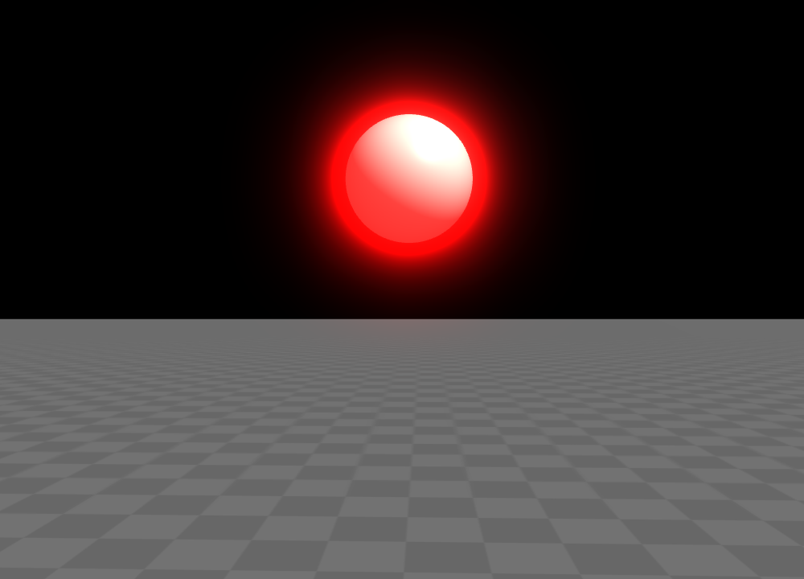

.. _label_common_props:

公共属性
~~~~~~~~~~~~~~~~~~~~~~~~~

我们注意到多种着色模型可能会共享一些公共的属性，下面对这些公共属性进行介绍。

环境光颜色 ambient : glm.vec3
>>>>>>>>>>>>>>>>>>>>>>>>>>>>>>>>>>

一些光照模型的视觉表现分为三层，分别为环境光部分、漫反射部分、镜面高光部分，如下图所示：

   图 1. 环境光、漫反射、镜面高光部分

环境光区域为光照不到的区域，材质的 ambient 属性则用来设置环境光区域的颜色。通常情况下，将 ambient 设置的较暗的颜色。

漫反射颜色 diffuse : glm.vec3
>>>>>>>>>>>>>>>>>>>>>>>>>>>>>>>>>

漫反射部分为被光照亮的部分，如图 1 所示。材质的 diffuse 属性被用来设置漫反射区域的颜色。通常情况下，将 diffuse 设置为主颜色。

高光颜色 specular : glm.vec3
>>>>>>>>>>>>>>>>>>>>>>>>>>>>>>>>

镜面高光部分为正好能将光反射进相机的部分，如图 1 所示。材质的 specular 属性被用来设置镜面高光区域的颜色。通常情况下，将 specular 设置为接近白色的颜色。

高光强度 shininess_strength : float
>>>>>>>>>>>>>>>>>>>>>>>>>>>>>>>>>>>>>

材质的高光强度属性 shininess_strength 用于提亮或减暗高光颜色，大于 1 则提亮，小于 1 则减暗。在 **Glass Engine** 内部是将高光强度 shininess_strength 与 specular 相乘得到的颜色作为真正使用的高光颜色。

闪耀度 shininess : float
>>>>>>>>>>>>>>>>>>>>>>>>>>>>>>>>

镜面高光部分的光点大小由 shininess 控制，图 2 反映了 shininess 对光点大小的影响：

    图 2. shininess 对光点大小的影响

光泽度 glossiness : float
>>>>>>>>>>>>>>>>>>>>>>>>>>>>>>>>

光泽度 glossiness 始终为 shininess 的算术平方根，通过 glossiness 调整闪耀度可使光点大小变化更均匀。

自发光颜色 emission : glm.vec3
>>>>>>>>>>>>>>>>>>>>>>>>>>>>>>>>

自发光颜色 emission 则会直接加到最终的光照结果上。设置较强的自发光颜色并开启 :ref:`label_bloom` 后，能够营造物体发射光芒的效果，例如将 emission 设置为 ``glm.vec3(10, 0, 0)`` 则表现为发红光，并开启 :ref:`label_bloom`：

::

    from glass_engine import *
    from glass_engine.Geometries import *

    scene, camera, light, _ = SceneRoam()
    light.generate_shadows = False

    sphere = Sphere(radius=0.5)
    sphere.position.z = 3

    # 设置自发光颜色为强红光
    sphere.material.emission = glm.vec3(10, 0, 0)
    scene.add(sphere)

    camera.screen.bloom = True # 开启泛光
    camera.screen.show()

能够达到如图 3 所示效果：

    图 3. 设置自发光为强红色的效果

.. note::

    自发光颜色 emission 只会添加到自身颜色上，它并没有任何光源的作用，不会照亮别的物体。如果想照亮别的物体，则请在场景中添加 :ref:`label_lights`。

边缘光强度 rim_power : float
>>>>>>>>>>>>>>>>>>>>>>>>>>>>>>>>>

将光源放置在物体后面，则能够观察到光沿着物体边缘延伸过来的边缘光 (rim light) 效果，如图 4 所示。

    图 4. 背光侧观察物体时的边缘光效果

可通过材质的 rim_power 属性调整边缘光强度，其默认值为 0.2，值越大，边缘光越强，如图 5 所示。

.. figure:: images/rim_power_compare.png
    :width: 800px
    :align: center

    图 5. rim_power 对边缘光强度的影响

环境映射层颜色 reflection : glm.vec4
>>>>>>>>>>>>>>>>>>>>>>>>>>>>>>>>>>>>>>>>>>>>

环境映射即反射和折射效果。材质的 reflection 属性可以控制环境映射层的颜色，该层颜色会与反射或折射颜色相乘，alpha 通道则控制反射或折射颜色的不透明度。默认情况下环境映射层颜色完全透明，即没有反射或折射的颜色。通过将其 alpha 通道设置为非 0 值，即可得到反射效果，例如设置球体材质的 reflection.a = 1 并添加 :ref:`label_skydome`：

::

    from glass_engine import *
    from glass_engine.Geometries import *

    scene, camera, light, _ = SceneRoam()
    scene.skydome = "https://dl.polyhaven.org/file/ph-assets/HDRIs/extra/Tonemapped%20JPG/sunflowers_puresky.jpg"

    sphere = Sphere()
    sphere.position.z = 1
    sphere.material.reflection.a = 1
    scene.add(sphere)

    camera.screen.show()

即可得到图 6 所示效果：

    图 6. 反射效果开启

环境映射与漫反射颜色是否混合 env_mix_diffuse : bool
>>>>>>>>>>>>>>>>>>>>>>>>>>>>>>>>>>>>>>>>>>>>>>>>>>>>>>

在图 6 中我们看到，反射层带有物体原本的颜色，这是因为材质的环境映射与漫反射颜色混合的 bool 属性 env_mix_diffuse 默认开启了，你可以通过下述代码将其关闭：

::

    sphere.material.env_mix_diffuse = False

则可以得到图 7 所示的效果：

    图 7. 关闭 env_mix_diffuse 后的反射效果

动态环境映射 dynamic_env_mapping : bool
>>>>>>>>>>>>>>>>>>>>>>>>>>>>>>>>>>>>>>>>>>>>

仔细观察图 7 你会发现，球面倒影中并没有地板。因为，如果没有开启动态环境映射 dynamic_env_mapping，则只会反射 :ref:`label_skybox` 或 :ref:`label_skydome`，场景中的其他物体则不予以反射。开启动态环境映射后，则可以反射场景中的其他物体。通过如下代码可以比较开启与不开启动态环境映射的区别：

::

    from glass_engine import *
    from glass_engine.Geometries import *

    scene, camera, light, _ = SceneRoam()
    scene.skydome = "https://dl.polyhaven.org/file/ph-assets/HDRIs/extra/Tonemapped%20JPG/sunflowers_puresky.jpg"

    sphere1 = Sphere()
    sphere1.position.z = 1
    sphere1.position.x = -1.5
    sphere1.material.reflection.a = 1
    sphere1.material.env_mix_diffuse = False
    sphere1.material.dynamic_env_mapping = False
    scene.add(sphere1)

    sphere2 = Sphere()
    sphere2.position.z = 1
    sphere2.position.x = 1.5
    sphere2.material.reflection.a = 1
    sphere2.material.env_mix_diffuse = False
    sphere2.material.dynamic_env_mapping = True
    scene.add(sphere2)

    model = TrefoilKnot()
    model.scale = 0.75
    model.pitch = -90
    model.position.z = 1
    model.position.y = -1
    scene.add(model)

    camera.screen.show()

能够得到图 8 所示结果：

    图 8. 左边的球没有开启动态环境映射，右边的开启了

自动更新环境映射贴图 auto_update_env_map : bool
>>>>>>>>>>>>>>>>>>>>>>>>>>>>>>>>>>>>>>>>>>>>>>>>>>>

当场景中有任何物体状态发生改变后，其环境映射镜像也应该跟着改变，但如果不开启材质的 auto_update_env_map，则镜像不会跟着改变，除非你手动调用材质的 ``update_env_map()`` 方法。所以，想要镜像随时保持更新，请开启 auto_update_env_map。

折射率 refractive_index : float
>>>>>>>>>>>>>>>>>>>>>>>>>>>>>>>>>>

环境映射除了可以反射，还可以实现折射效果，只需将材质的折射率属性 refractive_index 设置为非零值即可。下表是一些常见半透明材质的折射率：

.. list-table:: 常见半透明材质的折射率
   :widths: 10 20
   :align: center
   :header-rows: 1

   * - 材质
     - 折射率 refractive_index
   * - 空气
     - 1.00
   * - 水
     - 1.33
   * - 冰
     - 1.31
   * - 有机玻璃
     - 1.49
   * - 玻璃
     - 1.52
   * - 钻石
     - 2.42

通过如下代码将材质折射率设置为 1.52 ：

::

    from glass_engine import *
    from glass_engine.Geometries import *

    scene, camera, light, _ = SceneRoam()
    scene.skydome = "https://dl.polyhaven.org/file/ph-assets/HDRIs/extra/Tonemapped%20JPG/sunflowers_puresky.jpg"

    sphere1 = Sphere()
    sphere1.position.z = 1
    sphere1.material.refractive_index = 1.52
    sphere1.material.env_mix_diffuse = False
    sphere1.material.dynamic_env_mapping = True
    scene.add(sphere1)

    model = TrefoilKnot()
    model.pitch = -90
    model.position.z = 1
    model.position.x = -1
    model.position.y = 3
    scene.add(model)

    camera.screen.show()

能够产生图 9 所示的玻璃球效果：

    图 9. 设置折射率为 1.52

材质不透明度 opacity : float
>>>>>>>>>>>>>>>>>>>>>>>>>>>>>>>>>

当材质不透明度 opacity 为 1 时，则完全显示为材质的视觉表现；当材质的不透明度 opacity 为 0 时，则完全显示为本体的视觉表现；当 opacity 介于 0 到 1 之间时，表现效果则在本体颜色和材质效果之间插值。注意，opacity 并不代表物体表面的不透明度，而是材质的不透明度，要想让 opacity 直接代表表面的不透明度，可以将物体的本体颜色设置为完全透明，如下面代码所示：

::

    from glass_engine import *
    from glass_engine.Geometries import *

    scene, camera, _, _ = SceneRoam()

    sphere = Sphere()
    sphere.position.z = 1
    sphere.color = glm.vec4(0) # 本体颜色完全透明
    sphere.material.diffuse = glm.vec3(0, 1, 0) # 漫反射颜色为绿色
    sphere.material.opacity = 0.5 # 此时材质半透明等价于表面半透明
    scene.add(sphere)

    camera.screen.show()

会得到如图 10 所示结果：

   图 10. 本体颜色完全透明时，opacity 等价于表面不透明度

是否受雾影响 fog : bool
>>>>>>>>>>>>>>>>>>>>>>>>>>>

在设置场景的 :ref:`label_fog` 密度之后，默认情况下所有物体都受到了雾的影响。但可通过材质的 fog 属性控制该材质是否受雾影响。可通过如下代码能够对比是否开启 fog 选项的区别：

::

    from glass_engine import *
    from glass_engine.Geometries import *

    scene, camera, dir_light, _ = SceneRoam()
    scene.fog.density = 0.05 # 设置雾密度
    scene.skydome = "https://dl.polyhaven.org/file/ph-assets/HDRIs/extra/Tonemapped%20JPG/sunflowers_puresky.jpg"
    scene.background.distance = 20

    sphere1 = Sphere()
    sphere1.position.z = 1
    sphere1.position.x = -2
    sphere1.material.fog = False # 不受雾影响
    scene.add(sphere1)

    sphere2 = Sphere()
    sphere2.position.z = 1
    sphere2.position.x = 2
    sphere2.material.fog = True # 受雾影响
    scene.add(sphere2)

    camera.screen.show()

能够得到如图 11 所示的效果。

    图 11. 左边球不受雾影响，右边球受雾影响

是否投射阴影 cast_shadows : bool
>>>>>>>>>>>>>>>>>>>>>>>>>>>>>>>>>>>>>

默认情况下，所有物体都会投射阴影，但可通过材质的 cast_shadows 属性控制该材质是否投射阴影。可通过如下代码对比关闭投射阴影和开启投射阴影的效果：

::

    from glass_engine import *
    from glass_engine.Geometries import *

    scene, camera, dir_light, _ = SceneRoam()
    scene.skydome = "https://dl.polyhaven.org/file/ph-assets/HDRIs/extra/Tonemapped%20JPG/sunflowers_puresky.jpg"

    sphere1 = Sphere()
    sphere1.position.z = 1
    sphere1.position.x = -2
    sphere1.material.cast_shadows = False
    scene.add(sphere1)

    sphere2 = Sphere()
    sphere2.position.z = 1
    sphere2.position.x = 2
    sphere2.material.cast_shadows = True
    scene.add(sphere2)

    camera.screen.show()

能够得到如图 12 所示的效果。

    图 12. 左边球关闭投射阴影，右边球开启投射阴影

是否接收阴影 recv_shaodws : bool
>>>>>>>>>>>>>>>>>>>>>>>>>>>>>>>>>>>>>

默认情况下，所有物体都接收阴影，但可通过材质的 recv_shadows 属性控制该材质是否接收阴影。可通过如下代码对比关闭接收阴影和开启接收阴影的效果：

::

    from glass_engine import *
    from glass_engine.Geometries import *

    scene, camera, dir_light, _ = SceneRoam()
    scene.skydome = "https://dl.polyhaven.org/file/ph-assets/HDRIs/extra/Tonemapped%20JPG/sunflowers_puresky.jpg"
    dir_light.yaw = 90

    sphere1 = Sphere()
    sphere1.position.z = 1
    sphere1.position.y = 4
    sphere1.material.recv_shadows = False
    scene.add(sphere1)

    sphere2 = Sphere()
    sphere2.position.z = 1
    sphere2.material.recv_shadows = True
    scene.add(sphere2)

    box = Box(Lx=10, Ly=10, Lz=10)
    box.position.z = 5
    box.position.x = 7
    box.position.y = 2
    scene.add(box)

    camera.screen.show()

能够得到如图 13 所示的效果。

.. figure:: images/compare_recv_shadows.png
    :align: center
    :width: 400px

    图 13. 左上方的球关闭接收阴影，右下方的球开启接收阴影

可以看出，关闭了接收阴影属性后，即使完全处于阴影中，迎光面也会被照亮。

凹凸夸张系数 height_scale : float
>>>>>>>>>>>>>>>>>>>>>>>>>>>>>>>>>>>>>

当使用了凹凸贴图、法向量贴图后，可通过材质的 height_scale 属性控制凹凸程度。height_scale 默认值为 0.05，下图是添加凹凸贴图和法向量贴图后，两个盒子使用不同的 height_scale 的对比效果图：

    图 14. 不同 height_scale 对比效果图

纹理贴图
>>>>>>>>>>>>>>>>>>>>>>

在渲染中，一个物体的材质属性往往不是通体唯一的，而是每个片段位置一个值，这可以通过纹理贴图来实现。**Glass Engine** 支持以下纹理贴图：

- ``material.ambient_map``：环境光贴图
- ``material.diffuse_map``：漫反射贴图
- ``material.specular_map``：镜面高光贴图
- ``material.shininess_map``：闪耀度贴图
- ``material.glossiness_map``：光泽度贴图
- ``material.emission_map``：自发光贴图
- ``material.opacity_map``：材质不透明度贴图
- ``material.reflection_map``：环境映射层贴图
- ``material.base_color_map``：基础颜色贴图
- ``material.metallic_map``：金属度贴图
- ``material.roughness_map``：粗糙度贴图
- ``material.ao_map``：环境光遮蔽贴图
- ``material.normal_map``：法向量贴图
- ``material.height_map``：凹凸贴图
- ``material.arm_map``：环境光遮蔽、粗糙度、金属度压缩格式贴图

所有纹理贴图可直接设置为图片路径或网址字符串。你可以从 https://polyhaven.com/textures 下载到大量的纹理贴图，也可使用 :ref:`label_shadertory`。例如，下述代码将下载到的 `鹅卵石纹理 <https://polyhaven.com/a/ganges_river_pebbles>`_ 贴到一个立方体表面：

::

    from glass_engine import *
    from glass_engine.Geometries import *

    scene, camera, dir_light, _ = SceneRoam()
    scene.skydome = "https://dl.polyhaven.org/file/ph-assets/HDRIs/extra/Tonemapped%20JPG/sunflowers_puresky.jpg"

    box = Box()
    box.position.z = 0.5
    box.material.ao_map = "ganges_river_pebbles_ao_1k.png"
    box.material.arm_map = "ganges_river_pebbles_arm_1k.png"
    box.material.diffuse_map = "ganges_river_pebbles_diff_1k.png"
    box.material.height_map = "ganges_river_pebbles_disp_1k.png"
    box.material.normal_map = "ganges_river_pebbles_nor_gl_1k.png"
    box.material.roughness_map = "ganges_river_pebbles_rough_1k.png"
    scene.add(box)

    camera.screen.show()

可以打造如图 15 所示的效果：

    图 15. 应用多种纹理贴图的立方体