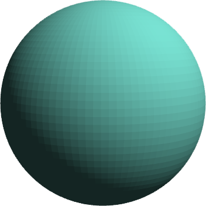
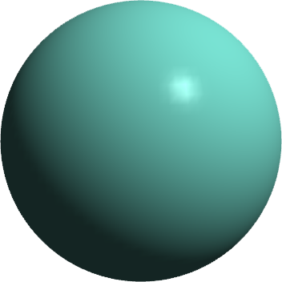
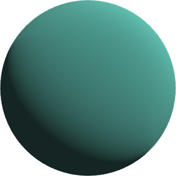
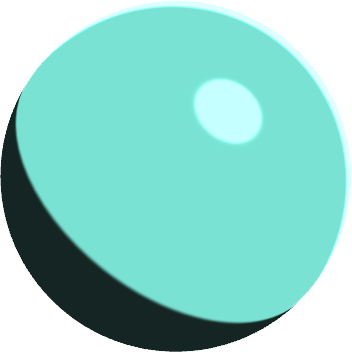
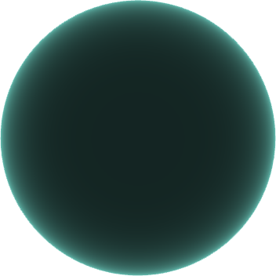
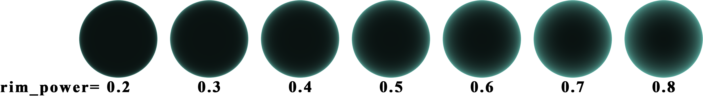

.. _label_shading_models:

着色模型
~~~~~~~~~~~~~~~~~~~~~~

下面分别介绍每种着色模型特有的材质属性：

.. _label_Unlit:

Unlit
>>>>>>>>>>>>>>>>>>

Unlit 为无光照模型，该模型使得材质颜色完全不受光照影响，如果设置了自发光，则表现为自发光颜色，否则表现为漫反射颜色和本体颜色的混合。可通过以下代码直接将物体的着色模型改为 Unlit：

::

    mesh.material.shading_model = None
    # mesh.material.shading_model = Material.ShadingModel.Unlit

Unlit 着色模型渲染效果如图 1 所示：

   图 1. Unlit 着色模型效果

Unlit 着色模型所支持的材质属性包括：

- ``material.diffuse : glm.vec3``：漫反射颜色；
- ``material.emission : glm.vec3``：自发光颜色；
- ``material.opacity : float``：材质不透明度；
- ``material.fog : bool``：是否受雾影响；
- ``material.cast_shadows : bool``：是否投射阴影。

这些属性均在材质 :ref:`label_common_props` 介绍过。另外，Unlit 模型支持的纹理贴图包括：

- ``material.diffuse_map``：漫反射颜色贴图；
- ``material.emission_map``：自发光颜色贴图；
- ``material.opacity_map``：材质不透明度贴图。

.. _label_Flat:

Flat
>>>>>>>>>>>>>>>>>>>

Flat 为平面光照模型，在几何着色器中计算出每个三角面的法向量随后直接着色，因此每个三角面具有同一个颜色，物体看起来就会棱角分明。Flat 模型只渲染漫反射颜色而不渲染高光，漫反射颜色算法采用 Lambert 模型。可通过下面代码直接将物体的着色模型改为 Flat：

::

	mesh.material.shading_model = Material.ShadingModel.Flat

Flat 着色模型渲染效果如图 2 所示：

   图 2. Flat 着色模型效果

Flat 着色模型所支持的材质属性包括：

- ``material.ambient : glm.vec3``：环境光颜色；
- ``material.diffuse : glm.vec3``：漫反射颜色；
- ``material.emission : glm.vec3``：自发光颜色；
- ``material.rim_power : float``：边缘光强度；
- ``material.reflection : glm.vec4``：环境映射层颜色；
- ``material.refractive_index : float``：折射率；
- ``material.env_mix_diffuse : bool``：环境映射与漫反射颜色是否混合；
- ``material.dynamic_env_mapping : bool``：是否开启动态环境映射；
- ``material.auto_update_env_map : bool``：是否自动更新环境映射贴图；
- ``material.opacity : float``：材质不透明度；
- ``material.height_scale : float``：凹凸夸张系数；
- ``material.fog : bool``：是否受雾影响；
- ``material.recv_shadows : bool``：是否接收阴影；
- ``material.cast_shadows : bool``：是否投射阴影；

这些属性均在材质 :ref:`label_common_props` 介绍过。另外，Flat 模型支持的纹理贴图包括：

- ``material.ambient_map``：环境光颜色贴图；
- ``material.diffuse_map``：漫反射颜色贴图；
- ``material.emission_map``：自发光颜色贴图；
- ``material.reflection_map``：环境映射层颜色贴图；
- ``material.opacity_map``：材质不透明度贴图。

.. _label_Gouraud:

Gouraud
>>>>>>>>>>>>>>>>>>>

Gouraud 光照模型逐顶点的渲染光照颜色，随后将颜色在三角面内插值，得到的渲染效果比 Flat Gouraud 模型漫反射颜色计算方法采用 Lambert 模型，高光颜色计算方法采用 Phong 模型。可通过下面代码直接将物体的着色模型改为 Gouraud：

::

	mesh.material.shading_model = Material.ShadingModel.Gouraud

Gouraud 着色模型渲染效果如图 3 所示：

   图 3. Gouraud 着色模型效果

Gouraud 着色模型所支持的材质属性包括：

- ``material.ambient : glm.vec3``：环境光颜色；
- ``material.diffuse : glm.vec3``：漫反射颜色；
- ``material.specular : glm.vec3``：镜面高光颜色；
- ``material.shininess_strength : float``：镜面高光强度；
- ``material.shininess : float``：闪耀度；
- ``material.glossiness : float``：光泽度；
- ``material.emission : glm.vec3``：自发光颜色；
- ``material.rim_power : float``：边缘光强度；
- ``material.reflection : glm.vec4``：环境映射层颜色；
- ``material.refractive_index : float``：折射率；
- ``material.env_mix_diffuse : bool``：环境映射与漫反射颜色是否混合；
- ``material.dynamic_env_mapping : bool``：是否开启动态环境映射；
- ``material.auto_update_env_map : bool``：是否自动更新环境映射贴图；
- ``material.opacity : float``：材质不透明度；
- ``material.height_scale : float``：凹凸夸张系数；
- ``material.fog : bool``：是否受雾影响；
- ``material.recv_shadows : bool``：是否接收阴影；
- ``material.cast_shadows : bool``：是否投射阴影；

这些属性均在材质 :ref:`label_common_props` 介绍过。另外，Gouraud 模型支持的纹理贴图包括：

- ``material.ambient_map``：环境光颜色贴图；
- ``material.diffuse_map``：漫反射颜色贴图；
- ``material.specular_map``：镜面高光颜色贴图；
- ``material.shininess_map``：闪耀度贴图；
- ``material.glossiness_map``：光泽度贴图；
- ``material.emission_map``：自发光颜色贴图；
- ``material.reflection_map``：环境映射层颜色贴图；
- ``material.opacity_map``：材质不透明度贴图。

.. _label_Phong:

Phong
>>>>>>>>>>>>>>>>>>>

Phong 光照模型逐像素的渲染光照颜色，因此得到的效果比 Gouraud 更平滑。Phong 光照模型在计算高光时，依据视线与反射向量的夹角的余弦值进行计算。其漫反射颜色计算方法采用 Lambert 模型。可通过以下代码直接将物体的着色模型改为 Phong：

::

	mesh.material.shading_model = Material.ShadingModel.Phong

Phong 着色模型效果如图 4 所示：

.. figure:: images/Phong.png
   :align: center
   :width: 150px

   图 4. Phong 着色模型效果

为了与下面要介绍的 Phong-Blinn 模型进行对比，渲染一张采用 Phong 光照模型的地板：

::

	from glass_engine import *
	from glass_engine.Geometries import *
	from glass_engine.Lights import *

	scene, camera, dir_light, floor = SceneRoam()
	scene.remove(dir_light)

	camera.position.y = -20

	point_light = PointLight()
	point_light.generate_shadows = False
	point_light.position.z = 5
	scene.add(point_light)

	sphere = Sphere(0.2)
	sphere.color = 10*point_light.color
	sphere.material.shading_model = Material.ShadingModel.Unlit
	sphere.material.cast_shadows = False
	sphere.material.recv_shadows = False
	point_light.add_child(sphere)

	floor.material.shading_model = Material.ShadingModel.Phong
	# floor.material.shading_model = Material.ShadingModel.PhongBlinn

	camera.screen.bloom = True
	camera.screen.show()

效果如图 5 所示：

   图 5. Phong 着色模型的地板

Phong 着色模型所支持的材质属性包括：

- ``material.ambient : glm.vec3``：环境光颜色；
- ``material.diffuse : glm.vec3``：漫反射颜色；
- ``material.specular : glm.vec3``：镜面高光颜色；
- ``material.shininess_strength : float``：镜面高光强度；
- ``material.shininess : float``：闪耀度；
- ``material.glossiness : float``：光泽度；
- ``material.emission : glm.vec3``：自发光颜色；
- ``material.rim_power : float``：边缘光强度；
- ``material.reflection : glm.vec4``：环境映射层颜色；
- ``material.refractive_index : float``：折射率；
- ``material.env_mix_diffuse : bool``：环境映射与漫反射颜色是否混合；
- ``material.dynamic_env_mapping : bool``：是否开启动态环境映射；
- ``material.auto_update_env_map : bool``：是否自动更新环境映射贴图；
- ``material.opacity : float``：材质不透明度；
- ``material.height_scale : float``：凹凸夸张系数；
- ``material.fog : bool``：是否受雾影响；
- ``material.recv_shadows : bool``：是否接收阴影；
- ``material.cast_shadows : bool``：是否投射阴影；

这些属性均在材质 :ref:`label_common_props` 介绍过。另外，Phong 模型支持的纹理贴图包括：

- ``material.ambient_map``：环境光颜色贴图；
- ``material.diffuse_map``：漫反射颜色贴图；
- ``material.specular_map``：镜面高光颜色贴图；
- ``material.shininess_map``：闪耀度贴图；
- ``material.glossiness_map``：光泽度贴图；
- ``material.emission_map``：自发光颜色贴图；
- ``material.reflection_map``：环境映射层颜色贴图；
- ``material.opacity_map``：材质不透明度贴图。

.. _label_PhongBlinn:

Phong-Blinn
>>>>>>>>>>>>>>>>>>>

Phong-Blinn 光照模型也是逐像素的渲染光照颜色，其在计算高光时，依据半程向量与表面法线夹角的余弦值进行计算。其漫反射颜色计算方法采用 Lambert 模型。可通过以下代码直接将物体的着色模型改为 Phong-Blinn：

::

	mesh.material.shading_model = Material.ShadingModel.PhongBlinn

Phong-Blinn 着色模型效果如图 6 所示：

   图 6. Phong-Blinn 着色模型效果

为了与上面介绍的 Phong 模型进行对比，同样渲染一张采用 Phong-Blinn 光照模型的地板，如图 7 所示：

   图 7. Phong-Blinn 着色模型的地板

可以看出 Phong-Blinn 模型渲染的地板效果比 Phong 模型更加真实。

Phong-Blinn 着色模型所支持的材质属性包括：

- ``material.ambient : glm.vec3``：环境光颜色；
- ``material.diffuse : glm.vec3``：漫反射颜色；
- ``material.specular : glm.vec3``：镜面高光颜色；
- ``material.shininess_strength : float``：镜面高光强度；
- ``material.shininess : float``：闪耀度；
- ``material.glossiness : float``：光泽度；
- ``material.emission : glm.vec3``：自发光颜色；
- ``material.rim_power : float``：边缘光强度；
- ``material.reflection : glm.vec4``：环境映射层颜色；
- ``material.refractive_index : float``：折射率；
- ``material.env_mix_diffuse : bool``：环境映射与漫反射颜色是否混合；
- ``material.dynamic_env_mapping : bool``：是否开启动态环境映射；
- ``material.auto_update_env_map : bool``：是否自动更新环境映射贴图；
- ``material.opacity : float``：材质不透明度；
- ``material.height_scale : float``：凹凸夸张系数；
- ``material.fog : bool``：是否受雾影响；
- ``material.recv_shadows : bool``：是否接收阴影；
- ``material.cast_shadows : bool``：是否投射阴影；

这些属性均在材质 :ref:`label_common_props` 介绍过。另外，Phong-Blinn 模型支持的纹理贴图包括：

- ``material.ambient_map``：环境光颜色贴图；
- ``material.diffuse_map``：漫反射颜色贴图；
- ``material.specular_map``：镜面高光颜色贴图；
- ``material.shininess_map``：闪耀度贴图；
- ``material.glossiness_map``：光泽度贴图；
- ``material.emission_map``：自发光颜色贴图；
- ``material.reflection_map``：环境映射层颜色贴图；
- ``material.opacity_map``：材质不透明度贴图。

.. _label_OrenNayar:

Oren-Nayar
>>>>>>>>>>>>>>>>>>>

Oren-Nayar 光照模型[`1 <https://doi.org/10.1145/192161.192213>`_] 是一种纯漫反射模型，对漫反射现象采取了更接近物理的近似，其将粗糙度考虑进来。Michael Oren 和 Shree K. Nayar 在 1994 年提出的 Oren-Nayar 光照模型对 Lambert 漫反射进行了很好地扩展并被广泛应用在计算机图形学中。该模型仅含有漫反射而没有高光。可通过以下代码直接将物体的着色模型改为 Oren-Nayar：

::

	mesh.material.shading_model = Material.ShadingModel.OrenNayar

Oren-Nayar 着色模型效果如图 8 所示：

   图 8. Oren-Nayar 着色模型效果

Oren-Nayar 着色模型所支持的材质属性包括：

- ``material.ambient : glm.vec3``：环境光颜色；
- ``material.diffuse : glm.vec3``：漫反射颜色；
- ``material.emission : glm.vec3``：自发光颜色；
- ``material.rim_power : float``：边缘光强度；
- ``material.roughness : float``：粗糙度；
- ``material.reflection : glm.vec4``：环境映射层颜色；
- ``material.refractive_index : float``：折射率；
- ``material.env_mix_diffuse : bool``：环境映射与漫反射颜色是否混合；
- ``material.dynamic_env_mapping : bool``：是否开启动态环境映射；
- ``material.auto_update_env_map : bool``：是否自动更新环境映射贴图；
- ``material.opacity : float``：材质不透明度；
- ``material.height_scale : float``：凹凸夸张系数；
- ``material.fog : bool``：是否受雾影响；
- ``material.recv_shadows : bool``：是否接收阴影；
- ``material.cast_shadows : bool``：是否投射阴影；

除了 roughness 外，其他属性均在材质 :ref:`label_common_props` 介绍过。roughness 取值范围为 0 到 1，默认为 0。不同 roughness 对 Oren-Nayar 模型的渲染效果影响如图 9 所示。

   图 9. 不同粗糙度下 Oren-Nayar 模型渲染效果

另外，Oren-Nayar 着色模型支持的纹理贴图包括：

- ``material.ambient_map``：环境光颜色贴图；
- ``material.diffuse_map``：漫反射颜色贴图；
- ``material.emission_map``：自发光颜色贴图；
- ``material.roughness_map``：粗糙度贴图；
- ``material.reflection_map``：环境映射层颜色贴图；
- ``material.opacity_map``：材质不透明度贴图。

.. _label_Minnaert:

Minnaert
>>>>>>>>>>>>>>>>>>

Minnaert 光照模型[`2 <https://www.researchgate.net/publication/247923568_The_Lambertian_Assumption_and_Landsat_Data>`_] 是一种纯漫反射模型，最初被设计用于还原月亮的阴影，因此通常称为月亮着色模型。Minnaert 擅长模拟多孔或纤维表面，例如月亮或天鹅绒。这些表面会导致大量光反向散射。在纤维主要垂直于天鹅绒、丝绒甚至地毯等表面的地方，这一点尤其明显。可通过以下代码直接将物体的着色模型改为 Minnaert：

::

	mesh.material.shading_model = Material.ShadingModel.Minnaert

Minnaert 着色模型渲染效果如图 10 所示：

   图 10. Minnaert 着色模型效果

Minnaert 着色模型所支持的材质属性包括：

- ``material.ambient : glm.vec3``：环境光颜色；
- ``material.diffuse : glm.vec3``：漫反射颜色；
- ``material.emission : glm.vec3``：自发光颜色；
- ``material.rim_power : float``：边缘光强度；
- ``material.roughness : float``：粗糙度；
- ``material.reflection : glm.vec4``：环境映射层颜色；
- ``material.refractive_index : float``：折射率；
- ``material.env_mix_diffuse : bool``：环境映射与漫反射颜色是否混合；
- ``material.dynamic_env_mapping : bool``：是否开启动态环境映射；
- ``material.auto_update_env_map : bool``：是否自动更新环境映射贴图；
- ``material.opacity : float``：材质不透明度；
- ``material.height_scale : float``：凹凸夸张系数；
- ``material.fog : bool``：是否受雾影响；
- ``material.recv_shadows : bool``：是否接收阴影；
- ``material.cast_shadows : bool``：是否投射阴影；

除了 roughness 外，其他属性均在材质 :ref:`label_common_props` 介绍过。roughness 取值范围为 0 到正无穷，默认为 0。不同 roughness 对 Minnaert 模型的渲染效果影响如图 11 所示。

   图 11. 不同粗糙度下 Minnaert 模型渲染效果

另外，Minnaert 着色模型支持的纹理贴图包括：

- ``material.ambient_map``：环境光颜色贴图；
- ``material.diffuse_map``：漫反射颜色贴图；
- ``material.emission_map``：自发光颜色贴图；
- ``material.roughness_map``：粗糙度贴图；
- ``material.reflection_map``：环境映射层颜色贴图；
- ``material.opacity_map``：材质不透明度贴图。

.. _label_Toon:

Toon
>>>>>>>>>>>>>>>>>>>

Toon 着色模型为卡通模式渲染，基于 Phong 光照模型，但任何颜色不再渐变而是突变，能够产生卡通效果。可通过以下代码直接将物体的着色模型改为 Toon：

::

    mesh.material.shading_model = Material.ShadingModel.Toon

Toon 着色模型效果如图 12 所示：

   图 12. Toon 着色模型效果

Toon 着色模型所支持的材质属性包括：

- ``material.ambient : glm.vec3``：环境光颜色；
- ``material.diffuse : glm.vec3``：漫反射颜色；
- ``material.specular : glm.vec3``：镜面高光颜色；
- ``material.shininess_strength : float``：镜面高光强度；
- ``material.shininess : float``：闪耀度；
- ``material.glossiness : float``：光泽度；
- ``material.emission : glm.vec3``：自发光颜色；
- ``material.rim_power : float``：边缘光强度；
- ``material.diffuse_bands : int``：漫反射条带数；
- ``material.specular_bands : int``：镜面高光条带数；
- ``material.diffuse_softness : float`` 漫反射条带过度软度；
- ``material.specular_softness : float`` 镜面高光条带过度软度；
- ``material.reflection : glm.vec4``：环境映射层颜色；
- ``material.refractive_index : float``：折射率；
- ``material.env_mix_diffuse : bool``：环境映射与漫反射颜色是否混合；
- ``material.dynamic_env_mapping : bool``：是否开启动态环境映射；
- ``material.auto_update_env_map : bool``：是否自动更新环境映射贴图；
- ``material.opacity : float``：材质不透明度；
- ``material.height_scale : float``：凹凸夸张系数；
- ``material.fog : bool``：是否受雾影响；
- ``material.recv_shadows : bool``：是否接收阴影；
- ``material.cast_shadows : bool``：是否投射阴影；

其中以下属性为 Toon 模型特有属性：

- ``material.diffuse_bands : int``：漫反射条带数；
- ``material.specular_bands : int``：镜面高光条带数；
- ``material.diffuse_softness : float`` 漫反射条带过度软度；
- ``material.specular_softness : float`` 镜面高光条带过度软度；

漫反射条带数 diffuse_bands 设置范围应该大于 2，它对渲染效果的影响如图 13 所示：

   图 13. 漫反射条带数对 Toon 着色效果的影响

镜面高光条带数 specular_bands 设置范围应该大于 2，它对渲染效果的影响如图 14 所示：

   图 14. 镜面高光条带数对 Toon 着色效果的影响

漫反射条带过度软度 diffuse_softness 设置范围应该在 0 到 1 之间，它对渲染效果的影响如图 15 所示：

   图 15. 漫反射条带过度软度对 Toon 着色效果的影响

镜面高光条带过度软度 specular_softness 设置范围应该在 0 到 1 之间，它对渲染效果的影响不明显，在此不再给出对比图。

另外，Toon 着色模型支持的纹理贴图包括：

- ``material.ambient_map``：环境光颜色贴图；
- ``material.diffuse_map``：漫反射颜色贴图；
- ``material.specular_map``：镜面高光颜色贴图；
- ``material.shininess_map``：闪耀度贴图；
- ``material.glossiness_map``：光泽度贴图；
- ``material.emission_map``：自发光颜色贴图；
- ``material.reflection_map``：环境映射层颜色贴图；
- ``material.opacity_map``：材质不透明度贴图。

.. _label_Fresnel:

Fresnel
>>>>>>>>>>>>>>>>>>

Fresnel 为菲涅尔着色模型，无论光照方向如何，仅显示边缘光。可通过以下代码将物体的着色模型改为 Fresnel：

::

	mesh.material.shading_model = Material.ShadingModel.Fresnel

Fresnel 着色模型效果如图 16 所示：

   图 16. Fresnel 着色模型效果

Fresnel 着色模型所支持的材质属性包括：

- ``material.ambient : glm.vec3``：环境光颜色；
- ``material.diffuse : glm.vec3``：漫反射颜色；
- ``material.emission : glm.vec3``：自发光颜色；
- ``material.rim_power : float``：边缘光强度；
- ``material.reflection : glm.vec4``：环境映射层颜色；
- ``material.refractive_index : float``：折射率；
- ``material.env_mix_diffuse : bool``：环境映射与漫反射颜色是否混合；
- ``material.dynamic_env_mapping : bool``：是否开启动态环境映射；
- ``material.auto_update_env_map : bool``：是否自动更新环境映射贴图；
- ``material.opacity : float``：材质不透明度；
- ``material.height_scale : float``：凹凸夸张系数；
- ``material.fog : bool``：是否受雾影响；
- ``material.recv_shadows : bool``：是否接收阴影；
- ``material.cast_shadows : bool``：是否投射阴影；

这些属性虽然都在材质 :ref:`label_common_props` 介绍过，但此处还需强调，Fresnel 着色模型的主要参数为 rim_power，rim_power 对 Fresnel 着色模型渲染效果的影响如图 17 所示：

   图 17. 不同 rim_power 对 Fresnel 着色模型渲染效果的影响

另外，Fresnel 着色模型支持的纹理贴图包括：

- ``material.ambient_map``：环境光颜色贴图；
- ``material.diffuse_map``：漫反射颜色贴图；
- ``material.emission_map``：自发光颜色贴图；
- ``material.reflection_map``：环境映射层颜色贴图；
- ``material.opacity_map``：材质不透明度贴图。

.. _label_PBR:

PBR
>>>>>>>>>>>>>>>>>

PBR 着色模型为基于物理的渲染 (Physical Based Rendering, PBR) 着色模型，在 **Glass Engine** 中，PBR 模型采用金属度/粗糙度工作流，尚不支持高光/光泽度工作流。其漫反射部分采用 Lambert 模型，镜面高光部分采用 Cook-Torrance 模型。我们知道基于图像的光照 (Image Based Lighting, IBL) 是 PBR 的重要组成部分，但目前 **Glass Engine** 的 PBR 只支持直接光照，还不支持 IBL，这在进一步的开发计划当中。你可以通过以下代码将物体的着色模型改为 PBR：

::

	mesh.material.shading_model = Material.ShadingModel.PBR

PBR 着色模型效果如图 18 所示：

   图 18. PBR 着色模型效果

PBR 着色模型支持的材质属性包括：

- ``material.ambient : glm.vec3``：环境光颜色；
- ``material.emission : glm.vec3``：自发光颜色；
- ``material.metallic : float``：金属度，取值范围在 0 到 1 之间，默认为 0.5；
- ``material.roughness : float``：粗糙度，取值范围在 0 到 1 之间，默认为 0；
- ``material.base_color : glm.vec3``：基础颜色；
- ``material.reflection : glm.vec4``：环境映射层颜色；
- ``material.refractive_index : float``：折射率；
- ``material.env_mix_diffuse : bool``：环境映射与漫反射颜色是否混合；
- ``material.dynamic_env_mapping : bool``：是否开启动态环境映射；
- ``material.auto_update_env_map : bool``：是否自动更新环境映射贴图；
- ``material.opacity : float``：材质不透明度；
- ``material.height_scale : float``：凹凸夸张系数；
- ``material.fog : bool``：是否受雾影响；
- ``material.recv_shadows : bool``：是否接收阴影；
- ``material.cast_shadows : bool``：是否投射阴影；

除了 :ref:`label_common_props` 介绍过属性之外，PBR 着色模型特有的属性为：

- ``material.metallic : float``：金属度；
- ``material.roughness : float``：粗糙度；
- ``material.base_color : glm.vec3``：基础颜色；

其中基础颜色 base_color 是你想要表现的主颜色，而金属度和粗糙度对 PBR 着色模型的渲染效果影响如图 19 所示：

   图 19. 金属度和粗糙度对 PRB 渲染效果的影响

另外，PBR 模型所支持的纹理贴图包括：

- ``material.ambient_map``：环境光贴图；
- ``material.emission_map``：自发光贴图；
- ``material.metallic_map``：金属度贴图；
- ``material.roughness_map``：粗糙度贴图；
- ``material.base_color``：基础颜色贴图；
- ``material.reflection_map``：环境映射层颜色贴图；
- ``material.opacity_map``：材质不透明度贴图；
