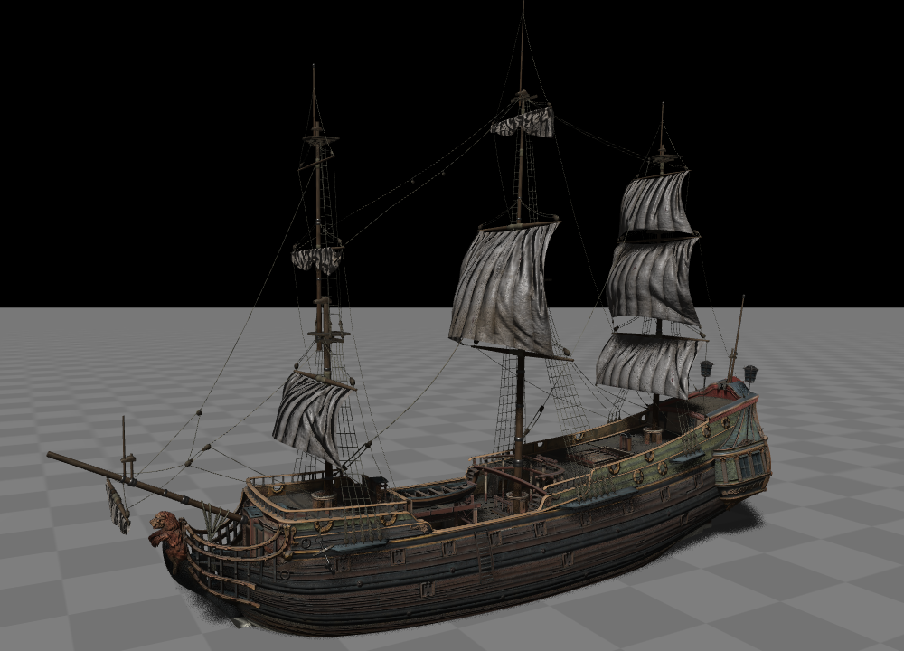

.. _label_model:

模型加载
====================

模型加载
~~~~~~~~~~~~~~~~~~~

得益于 `assimp <https://assimp-docs.readthedocs.io/en/latest/about/introduction.html#dependencies>`_，**Glass Engine** 支持以下格式的 3D 模型加载：

- 3D Manufacturing Format (.3mf)
- Collada (.dae, .xml)
- Blender (.blend)
- Biovision BVH (.bvh)
- 3D Studio Max 3DS (.3ds)
- 3D Studio Max ASE (.ase)
- glTF, glTF2.0 (.glTF)
- FBX-Format, as ASCII and binary (.fbx)
- Stanford Polygon Library (.ply)
- AutoCAD DXF (.dxf)
- IFC-STEP (.ifc)
- IQM-Format (.iqm)
- Neutral File Format (.nff)
- Sense8 WorldToolkit (.nff)
- Valve Model (.smd, .vta)
- Quake I (.mdl)
- Quake II (.md2)
- Quake III (.md3)
- Quake 3 BSP (.pk3)
- RtCW (.mdc)
- Doom 3 (.md5mesh, .md5anim, .md5camera)
- DirectX X (.x)
- Quick3D (.q3o, .q3s)
- Raw Triangles (.raw)
- AC3D (.ac, .ac3d)
- Stereolithography (.stl)
- Autodesk DXF (.dxf)
- Irrlicht Mesh (.irrmesh, .xml)
- Irrlicht Scene (.irr, .xml)
- Object File Format (.off)
- Wavefront Object (.obj)
- Terragen Terrain (.ter)
- 3D GameStudio Model (.mdl)
- 3D GameStudio Terrain (.hmp)
- Ogre (.mesh.xml, .skeleton.xml, .material)
- OpenGEX-Fomat (.ogex)
- Milkshape 3D (.ms3d)
- LightWave Model (.lwo)
- LightWave Scene (.lws)
- Modo Model (.lxo)
- CharacterStudio Motion (.csm)
- Stanford Ply (.ply)
- TrueSpace (.cob, .scn)
- XGL-3D-Format (.xgl)

在 **Glass Engine** 中加载 3D 模型十分简单，只需使用 ``Model(file_name)`` 创建对象即可。你可以从下列网站下载到大量免费的 3D 模型：

- https://polyhaven.com/models
- https://free3d.com/

例如，我下载了一个 `帆船 <https://polyhaven.com/a/ship_pinnace>`_ 的模型，然后用下述代码将其加载到 **Glass Engine** 中显示：

.. highlight:: python3

::

	from glass_engine import *

	scene, camera, _, _ = SceneRoam()

	model = Model("path/to/ship_pinnace_4k.gltf") # 指向文件而不是文件夹
	model["root"].scale = 0.2
	model["root"].pitch = 90
	scene.add(model)

	camera.screen.show()

运行这段代码，你将得到图 1 所示结果。

   图 1. 加载并显示一个帆船模型

由于网上下载的 3D 模型建模时使用的坐标系轴指向与 **Glass Engine** 中可能有所不同，而且其顶点坐标单位可能也有所不同，因此我们加载上来之后需要进行适当的缩放和旋转。注意到，这里我们没有直接对 ``model`` 进行缩放和旋转，而是对其下的名为 "root" 的子节点进行缩放旋转，是为了在之后对 ``model`` 本身的空间变换不受初始对齐校正的影响。

每个模型加载上来后，都会有一个 "root" 子节点，在 **Glass Engine** 的节点系统中，我们可以通过 ``[]`` 的方式访问到某个场景节点的子节点，如果模型姿态和尺寸不合适，建议通过模型的 "root" 子节点进行调整。你可以使用 ``print(model)`` 来显示 ``model`` 对象的所有子节点构成的节点树，针对这个帆船，打印结果为：

::

	ship_pinnace_4k.gltf
	  root
	    ship_pinnace_aft
	      Plane.041
	    ship_pinnace_rigging
	      Cylinder.042
	    ship_pinnace_details
	      Plane.046
	    ship_pinnace_hull
	      Plane.498
	    ship_pinnace_deck
	      Plane.057
	    ship_pinnace_interior
	      Plane.043
	    ship_pinnace_sails
	      Plane.002

后处理参数
~~~~~~~~~~~~~~~~~~~

你还可以通过一些参数来对模型加载进行更精细的控制，例如可以让模型加载完成时做一些后处理操作，让这些操作名称通过 ``Flag`` 形式传给 ``Model`` 的 ``flags`` 参数即可。下面是所有支持的后处理操作，在使用时带上 ``Model.PostProcessSteps.`` 即可，可通过位运算符 ``~, |, &`` 对这些 ``Flag`` 进行组合。

- ``CalcTangentSpace``: 生成切线和福切线，将用在法向量贴图和凹凸贴图上，默认已传入；
- ``JoinIdenticalVertices``: 合并相同顶点，可减少顶点数，默认已传入；
- ``Triangulate``: 将非三角形的面转化为三角形，默认已传入；
- ``GenNormals``: 如果模型没有法向量，则生成法向量，默认已传入；
- ``GenSmoothNormals``: 如果模型没有法向量，则生成平滑的法向量；
- ``SplitLargeMeshes``: 将包含较多三角形数量的网格切分为多个子网格，防止超过硬件限制，默认已传入；
- ``PreTransformVertices``: 生成单个网格，无节点树状结构；
- ``LimitBoneWeights``: 在骨骼动画中，将同时影响单个顶点的骨骼数限制到 4；
- ``ValidateDataStructure``: 验证导入的模型数据结构，如有错误则会抛出异常，默认已传入；
- ``ImproveCacheLocality``: 对三角形重新排序以提高缓存命中率；
- ``RemoveRedundantMaterials``: 删除未引用的材质；
- ``FixInfacingNormals``: 翻转朝内的法向量；
- ``PopulateArmatureData``: 生成骨骼动画中的骨架数据；
- ``SortByPType``: 拆分具有多种基元类型的网格，使得每一个子网格仅具有单一的基元类型，默认已传入；
- ``FindDegenerates``: 将退化基元转化为正确的线或点；
- ``FindInvalidData``: 删除或修复无效数据，例如零法向量和错误的纹理坐标；
- ``GenUVCoords``: 将非 UV 贴图纹理坐标转化为正确的 UV 贴图纹理坐标；
- ``TransformUVCoords``: 将纹理坐标变换信息直接应用到纹理坐标上；
- ``FindInstances``: 将完全相同的网格合并为一个网格；
- ``OptimizeMeshes``: 减少网格数量，进而减少绘制调用；
- ``OptimizeGraph``: 优化节点层次结构；
- ``FlipUVs``: 将纹理坐标 y 轴翻转（变为 1 - y）；
- ``FlipWindingOrder``: 将三角形的顶点连接顺序反序；
- ``SplitByBoneCount``: 将含有多个骨骼的网格划分为多个网格；
- ``Debone``: 删除一些影响较小的网格；
- ``GlobalScale``: 依据模型定义的单位进行全局缩放；
- ``EmbedTextures``: 将纹理改为嵌入式纹理，而不依赖于外部文件；
- ``ForceGenNormals``: 强制重新生成法向量；
- ``DropNormals``: 删除所有法向量；
- ``GenBoundingBoxes``: 生成包围盒，默认已传入；

为防止覆盖默认参数，可通过设置 ``Model`` 的 ``extra_flags`` 参数对默认传入的 ``flags`` 进行补充，通过设置 ``exclude_flags`` 参数对默认 ``flags`` 进行剔除。例如，想要在默认 ``flags`` 的基础上强制重新生成法向量并生成平滑的法向量，则可以调用：

::

	Model(file_name, extra_flags=(Model.PostProcessSteps.ForceGenNormals | Model.PostProcessSteps.GenSmoothNormals))
