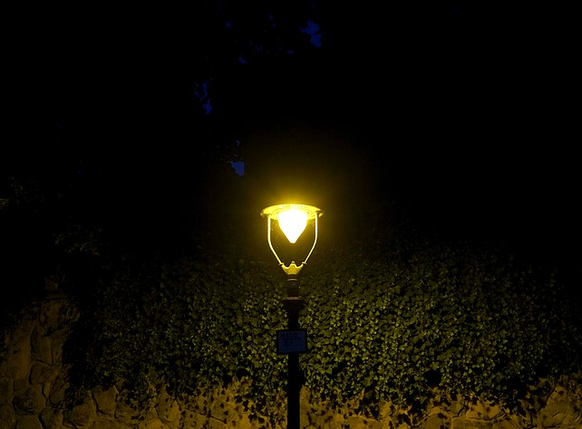

.. _label_PPEs:

后处理效果
=================

后处理是在渲染结束后对屏幕图像进行图像处理的技术，可以通过低廉的的成本大幅提升渲染品质。**Glass Engine** 内置了多种后处理效果，简称后效。在 **Glass Engine** 中，所有后效应该放入 ``camera.screen.post_process_effects`` 字典中方可生效。该字典为有序字典，所有后效按先后顺序执行，其中已有了一些内置的后效，包括：

- ``camera.screen.post_process_effects["SSAO"]``：SSAO 后效；
- ``camera.screen.post_process_effects["bloom"]``：泛光；
- ``camera.screen.post_process_effects["DOF"]``：景深；
- ``camera.screen.post_process_effects["explosure_adaptor"]``：曝光调整；
- ``camera.screen.post_process_effects["tone_mapper"]``：色调映射；
- ``camera.screen.post_process_effects["FXAA"]``：快速近似抗锯齿。

这些内置后效可分别通过以下方式快捷访问到，而你自定义的则不能：

- ``camera.screen.SSAO``：SSAO 后效；
- ``camera.screen.bloom``：泛光；
- ``camera.screen.DOF``：景深；
- ``camera.screen.explosure_adaptor``：曝光调整；
- ``camera.screen.tone_mapper``：色调映射；
- ``camera.screen.FXAA``：快速近似抗锯齿。

接下来会详细介绍这些内置后效，并讲解如何添加自定义后效。

SSAO
~~~~~~~~~~~~~~~~~

屏幕空间环境光遮蔽 (Screen-Space Ambient Occlusion, SSAO) 是 **Glass Engine** 内置的后效之一。它通过对墙角、褶皱处进行暗化处理来提升场景立体感。你可以通过 ``camera.screen.SSAO = True`` 来打开 SSAO，以及以下属性来控制 SSAO 的其他参数：

- ``camera.screen.SSAO.power:float``：SSAO 强度，用于控制 SSAO 区域的黑暗程度，值越大越暗，默认为 2.2，建议设置为大于 1 的值；
- ``camera.screen.SSAO.radius:float``：SSAO 探测半径，单位为米，用于控制 SSAO 暗区范围，值越大范围越大，默认为 0.2，建议设置在 0 到 1 之间；
- ``camera.screen.SSAO.samples:int``：SSAO 样本点数量，用于控制 SSAO 品质， 样本点个数越多，品质越高，但渲染效率越低，默认为 64。

图 1 是关闭 SSAO 和开启 SSAO 的对比效果（场景来自于 `模型加载 <../model/model.html>`_ 一章中加载的帆船内部），注意观察开启 SSAO 后的拐角处已变暗。

   图 1. SSAO 关闭开启效果对比

.. _label_bloom:

泛光
~~~~~~~~~~~~~~~~~

如果你仔细观察过晚上的路灯的话你会发现，路灯会向周围发出光芒，如图 2 所示：

   图 2. 夜间路灯会发出光芒（图片来自网络）

这种光芒效果称之为泛光 (Bloom)，在 **Glass Engine** 要想使物体产生泛光非常简单，只需遵循以下两步即可：

1. 通过 ``color`` 或 ``material.diffuse, material.emission`` 等方法设置物体颜色值超过 1
2. 开启 ``camera.screen`` 的 ``bloom`` 属性：``camera.screen.bloom = True``

你还可以通过以下参数控制泛光强度：

- ``camera.screen.bloom.strength:float``：泛光强度，默认值为 0.5，建议设置在 0 到 1 之间
- ``camera.screen.bloom.blur_times:int``：模糊次数，次数越多，泛光范围越大，默认为 6
- ``camera.screen.bloom.threshold:float``：泛光阈值，亮度超过该阈值的像素会产生泛光，默认为 1

通过以下代码可以制作一个简单的泛光效果：

::

    from glass_engine import *
    from glass_engine.Geometries import *

    scene, camera, _, _ = SceneRoam()

    sphere = Sphere(color=glm.vec3(20, 20, 0)) # 设置颜色为极亮的黄色
    sphere.position.z = 3
    scene.add(sphere)

    camera.screen.bloom = True # 开启泛光
    camera.screen.show()

能够观察到开启与不开启泛光的效果如图 3 所示：

   图 3. 开启与不开启泛光的对比

.. _label_Explosure:

曝光度调整
~~~~~~~~~~~~~~~~

当场景过亮时会产生过曝光，过暗时会产生欠曝光，为了能够人为的或自动的控制曝光度，可开启曝光调整后效，方法为 ``camera.screen.explosure_adaptor = True``。开启后默认为自动调整曝光，类似于手机照相，通过点击屏幕，以击中的像素附近的亮度做为参考进行曝光调整，也可切换为手动调节曝光，方法为：

- ``camera.lens.auto_explosure:bool``：是否自动曝光，默认为 ``True``；
- ``camera.lens.explosure:float``：曝光度，默认为 1，仅当设置为手动曝光才生效；
- ``camera.lens.local_explosure:bool``：是否开启局部曝光适应，默认为关闭，仅当设置为自动曝光才生效。开启局部曝光适应后，在一帧图像里，过亮的区域会减少曝光，过暗的区域会增加曝光；
- ``camera.lens.explosure_adapt_time:float``：曝光适应所需时间，单位为秒，默认为 2 秒，仅当设置为自动曝光且没有局部曝光适应才生效。

HDR 色调映射
~~~~~~~~~~~~~~~~~

当场景中有任何像素值超过 1 的像素时，即处在 HDR 色域范围，会导致过亮处失去细节，一般在多光源情况下会产生该种情况。如果单纯通过曝光调整不能达到很好的色彩效果时，可尝试开启 HDR 色调映射，方法为 ``camera.screen.tone_mapper = True`` 其没有任何用户可操作的参数。图 4 为关闭开启色调映射的对比：

   图 4. 开启与不开启色调映射的对比

在上述场景中添加了两个光源，因此如果不开启色调映射，图像将产生过曝，如上图左边所示。开启色调映射之后，过亮处细节也可以得到保留。（场景中模型均下载自 https://polyhaven.com）

LUT 滤镜
~~~~~~~~~~~~~~~~

你会发现，开启色调映射后，过曝区域虽然消失，但是图像亮度对比度明显降低。解决方法是再添加 LUT (Look up Table, LUT) 调色滤镜。方法为：首先将窗口截图，或通过相机 :ref:`label_take_photo` 功能 ``camera.take_photo("file_name.png")`` 捕获图像，然后对所得图片在 Photo Shop 中进行调色，将调色结果导出为 cube 文件，最后使用 ``LUTEffect`` 将 cube 文件添加为后效即可。例如，我将不满意的截图在 PhotoShop 中进行调色后，得到图 5：

   图 5. 经过 PhotoShop 调色后的截图

然后将调色结果导出为 cube 文件（:menuselection:`文件 --> 导出 --> 颜色查找表`，在格式处仅勾选 CUBE），例如导出名为 "test.cube"，最后将其设置为屏幕的 LUT 后效：

::

    from glass_engine.PostProcessEffects import *
    camera.screen.post_process_effects["lut"] = LUTEffect("test.cube")

即可让画面达到相同的调色效果。如果你不想自己调色，可以从 https://freshluts.com/ 下载大量免费的 cube 文件以供直接使用。创建的 LUT 后效 ``lut_effect = LUTEffect("test.cube")`` 含有两个可控属性：

- ``lut_effect.contribute:float``：贡献度，默认为 1，表示 LUT 作用后的图像与原图的混合比例；
- ``lut_effect.LUT:str``：LUT 的 cube 文件名称，可运行中途切换，也可为 LUT 图像文件名称；

上面提到，除了使用 LUT 的 cube 文件，还可以是 LUT 图像文件，一般 LUT 图像模样如图 6 所示：

   图 6. LUT 图像

.. _label_DOF:

景深
~~~~~~~~~~~~~~~~~

在现实世界中拍照时，被对焦的物体成像清晰，其他物体成像模糊，这种效果称为景深。如图 7 所示：

   图 7. 景深效果（图片来自网络）

景深为 **Glass Engine** 的内置后效之一，可通过 ``camera.screen.DOF = True`` 直接开启。开启景深后，再观察场景，能够得到如图 8 所示的显示效果：

   图 8. 对焦到两个不同杯子上的效果对比（图片来自 **Glass Engine** 渲染结果）

通过点击物体，可直接实现对焦到该物体。你还可以通过以下参数来控制景深效果：

- ``camera.lens.auto_focus:bool``：是否自动对焦，默认为 ``True``，开启后则接受鼠标点击对焦；
- ``camera.lens.focus:float``：焦距，单位为米，默认为 0.09 米，仅当关闭自动对焦生效；
- ``camera.lens.clear_distance:float``：清晰距离，单位为米，距离相机该距离的物体最清晰，仅当关闭自动对焦生效；
- ``camera.lens.aperture:float``：光圈直径，单位为米，默认为 0.05 米，光圈越大，景深效果越明显；
- ``camera.lens.focus_change_time:float``：变焦时间，单位为秒，默认为 2 秒，用于控制自动变焦快慢，仅当开启自动对焦生效。

快速近似抗锯齿
~~~~~~~~~~~~~~~~~

快速近似抗锯齿 (Fast Approximate Anti-Aliasing, FXAA) 可通过 ``camera.screen.FXAA = Ture/False`` 来实现开启和关闭。使用 :ref:`label_ForwardRenderer` 时，默认 FXAA 已关闭，采用硬件多重采样抗锯齿 (Multi-Samples Anti-Aliasing, MSAA)；使用 :ref:`label_DeferredRenderer` 时，默认 MSAA 已关闭，FXAA 已开启。

.. _label_self_defined_PPE:

自定义后处理效果
~~~~~~~~~~~~~~~~~

如果想编写自定义后效，只需新建一个文件并在其中编写 glsl 函数，然后使用 ``ShaderEffect`` 将其设置为后效即可。要编写的函数为：

::

    vec4 post_process(sampler2D screen_image, vec2 tex_coord)
    {
        ...
    }

在该函数中，``screen_image`` 代表当前帧图像，``tex_coord`` 代表当前像素纹理坐标，左下为 (0, 0)，右上为 (1, 1)，可通过 ``texture(screen_image, tex_coord)`` 获取当前位置像素。在编写过程中，可使用如下函数：

- ``vec3 view_pos_of(vec2 tex_coord)``：获取某个像素点在相机观察空间的位置坐标；
- ``vec3 world_pos_of(vec2 tex_coord)``：获取某个像素点在世界空间的位置坐标；
- ``vec3 view_normal_of(vec2 tex_coord)``：获取某个像素点在相机观察空间的法向量；
- ``vec3 world_normal_of(vec2 tex_coord)``：获取某个像素点在世界空间的法向量；
- ``vec2 view_pos_to_tex_coord(vec3 view_pos)``：获取某个相机观察空间位置的纹理坐标；
- ``vec2 world_pos_to_tex_coord(vec3 world_pos)``：获取某个世界空间位置的纹理坐标；

还可访问到以下 uniform 变量：

- ``float iTime``：从程序启动到现在的时间，单位为秒；
- ``float iTimeDelta``：两帧的时间间隔，单位为秒；
- ``float iFrameRate``：帧率，单位为 Hz；
- ``int iFrame``：当前为渲染的累计第几帧；
- ``vec4 iDate``：当前日期 (年, 月, 日, 秒)；
- ``sampler2D view_pos_map``：观察空间位置贴图；
- ``sampler2D view_normal_map``：观察空间法向量贴图；
- ``sampler2D depth_map``：观察空间深度贴图；
- ``Camera camera``：相机。

下面为法向量可视化的一个自定义后效实现方法，首先编写文件 show_normal.glsl，在其中写入如下内容：

::

    vec4 post_process(sampler2D screen_image, vec2 tex_coord)
    {
        vec3 normal = world_normal_of(tex_coord);

        vec4 color;
        color.rgb = (normal + 1.0)/2.0;
        color.a = 1;
        return color;
    }

然后创建后效：

::

    from glass_engine.PostProcessEffects import *
    camera.screen.post_process_effects["show_normal"] = ShaderEffect("show_normal.glsl")

针对同样的场景，我们可以看到如图 9 所示的渲染结果：

   图 9. 自定义后处理效果（用颜色显示法向量）

如果你在自己写的 Shader 中含有 uniform 变量，则可通过 [] 直接给其赋值。例如：

::

    uniform float contribute;

    vec4 post_process(sampler2D screen_image, vec2 tex_coord)
    {
        vec3 normal = world_normal_of(tex_coord);
        vec4 color = vec4((normal + 1.0)/2.0, 1.0);
        vec4 original_color = texture(screen_image, tex_coord);
        return mix(original_color, color, contribute);
    }

在 Python 端，直接使用以下语句：

::

    my_effect = ShaderEffect("show_normal.glsl")
    my_effect["contribute"] = 0.5

即可完成对 uniform 变量 ``contribute`` 的赋值。如果 uniform 变量是结构体或数组，只要 Python 端定义有相同的类结构，使用其实例对 uniform 变量进行赋值即可。