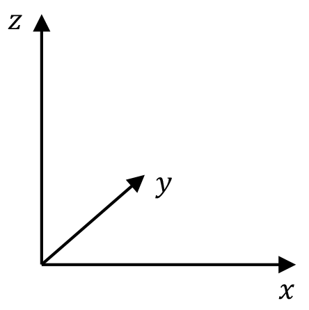
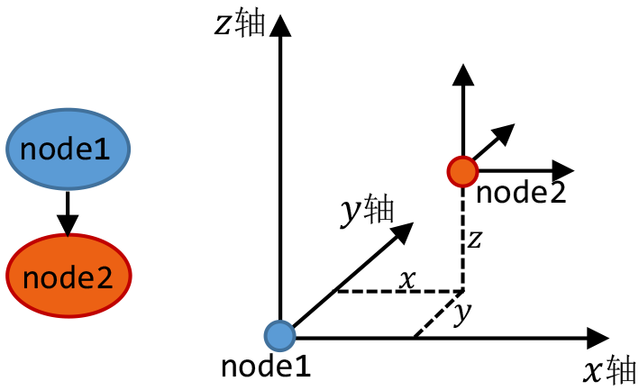
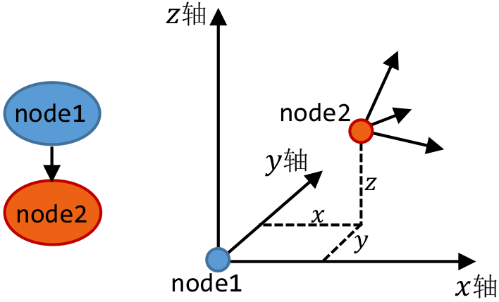
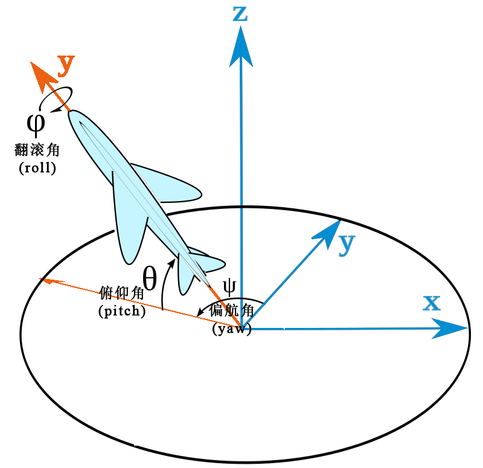
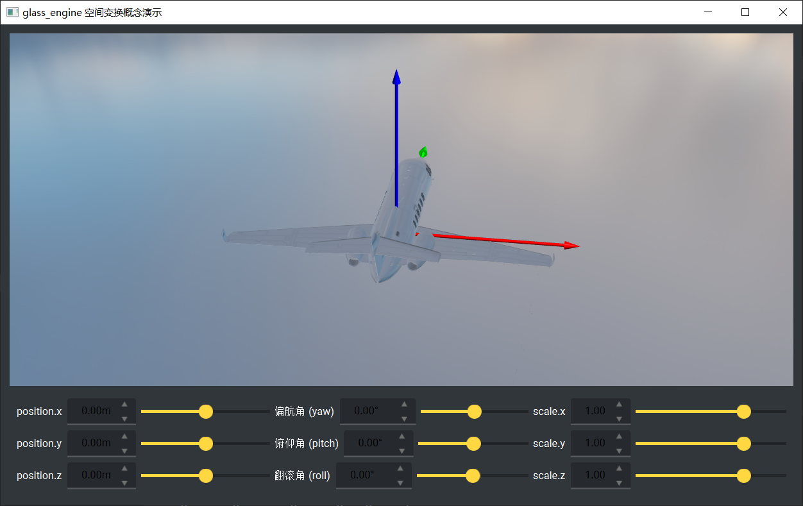

.. _label_transform:

空间变换
==================

坐标系
~~~~~~~~~~~~~~~~~~~~

在 **Glass Engine** 中，所有场景节点代表一个坐标系，其下所有子节点的空间变换描述均是相对于该坐标系而言。每一个节点的坐标系均为 **右手系**，满足 :math:`\boldsymbol{u}_x\times\boldsymbol{u}_y=\boldsymbol{u}_z`，并且 :math:`x` 轴指右，:math:`y` 轴指前，:math:`z` 轴指上，如图 1 所示。

   图 1. 场景节点的坐标系轴朝向

位置
~~~~~~~~~~~~~~~~~~~~

每个场景节点含有 ``position`` 属性，可通过设置 ``position.x, position.y, position.z`` 来设置场景节点的位置坐标，也可通过直接指定 ``node.position = glm.vec3(x, y, z)`` 来同时设置三个坐标分量。``position`` 的坐标 :math:`(x, y, z)` 代表该场景节点所代表的坐标系的原点相对于其父节点所代表的的坐标系的位置坐标，单位为 **米** (m)。如图 2 所示。

   图 2. node2 是 node1 的子节点，node2 的位置坐标则是相对于 node1 代表的坐标系而言的

姿态
~~~~~~~~~~~~~~~~~~~~

子坐标系相对于父坐标系还可以有姿态上的变换，如图 3 所示。

   图 3. node2 相对于 node1 有姿态上的变换

**Glass Engine** 采用 **姿态角** 来描述姿态上的变换。当没有姿态变换时，node2 与 node1 的三个坐标轴分别平行，称为初始姿态。node2 想要从初始姿态变换到任意给定姿态，均可通过多次绕不同轴的旋转实现。事实上，从一个姿态到另一个姿态，都可通过绕一个轴的一次旋转实现，但此处不采用一次旋转的方法描述，而是通过依次绕下面所说的三个轴的旋转来描述：

从初始姿态开始，node2 先绕自身 :math:`z` 轴旋转 :math:`\psi`，再绕自身 :math:`x` 轴旋转 :math:`\theta`，再绕自身 :math:`y` 轴旋转 :math:`\varphi` 所达到的姿态的姿态角记为 :math:`(\psi, \theta, \varphi)`，称 :math:`\psi` 为 **偏航角(yaw)**，:math:`\theta` 为 **俯仰角(pitch)**，:math:`\varphi` 为 **翻滚角(roll)**。

将 **偏航角(yaw)**、**俯仰角(pitch)**、**翻滚角(roll)** 标在图中如图 5 所示。

   图 5. node2 相对于 node1 的姿态角

图中蓝色坐标系为 node1 代表的坐标系，橙色坐标系为 node2 代表的坐标系。可以看出，同样地，一个场景节点的姿态描述，也是相对于其父节点代表的坐标系而言的。

在 **Glass Engine** 中，一个场景节点 ``node`` 的姿态角可分别通过 ``node.yaw, node.pitch, node.roll`` 进行设置，单位为 **度** (:math:`^\circ`)

.. important::
	上面提到的先 **Z** 后 **X** 再 **Y** 的旋转顺序是极其重要，不能打乱的，如果旋转顺序错乱，将会得到不一样的姿态。你会在其他地方看到不同的旋转顺序，这是因为它们所取的坐标轴朝向与 **Glass Engine** 不同。本质上讲，是先饶自身上下朝向的轴旋转 yaw、再绕自身左右朝向的轴旋转 pitch、再绕自身前后朝向的轴旋转 roll 得到姿态角 (yaw, pitch, roll)。而 **Glass Engine** 中则定义 :math:`z` 轴朝上、:math:`x` 轴朝右、:math:`y` 轴朝前，才有了 **ZXY** 的旋转顺序。

.. important::
	在上面的描述中一再提到是绕 node2 自身的轴旋转，这是极其重要的。因为 node2 某次旋转之后，其自身的坐标轴则发生了改变，再说绕自身某个轴旋转时，说的是绕改变后的轴旋转。这种旋转描述方式称为 **动轴** 描述法。对应地，绕 **定轴** 旋转能达到相同的效果，但旋转顺序需要颠倒过来。也就是说，node2 按照下面的方式旋转，能达到相同的姿态角 (yaw, pitch, roll)：

	node2 先绕 node1 的 :math:`y` 轴旋转 roll，再绕 node1 的 :math:`x` 轴旋转 pitch，再绕 node1 的 :math:`z` 轴旋转 yaw。

	注意到，刚才描述的这种旋转方式三次绕的轴都是 node1 的轴，是固定不动地，但是旋转顺序刚好与绕动轴的描述相反，这两种旋转方式均能达到相同的姿态。

.. important::
	在上面以及任何地方出现的“**绕某个轴旋转某个角度**”的描述中，旋转的正方向均为右手螺旋方向，即右手大拇指指向轴方向，四指弯曲所指向的方向即为旋转正方向，如图 6 所示。

	.. figure:: images/righthand.png
	   :alt: 右手螺旋
	   :align: center
	   :width: 200px

	   图 6. 右手螺旋法则指出旋转正方向

缩放
~~~~~~~~~~~~~~~~~~~~

一个场景节点 ``node`` 相对于其父节点的缩放可通过属性 ``node.scale`` 进行设置，以下设置方法均合法：

::

	node.scale.x = 0.5  # x 方向缩小为原来的 0.5
	node.scale.y = 0.8  # y 方向缩小为原来的 0.8
	node.scale.z = -1.2 # z 方向放大为原来的 1.2 倍并翻转
	node.scale = 2 # x, y, z 方向同时放大为原来的 2 倍
	node.scale = glm.vec3(2, 3, 4) # 分别设置 x, y, z 方向的缩放系数

其含义为该节点 ``node`` 及其所有直接或间接子节点关于 ``node`` 的原点，沿对应的轴进行缩放。当缩放系数绝对值大于 1 意为放大，缩放系数绝对值小于 1 意为缩小，缩放系数小于零意为翻转。

例子
~~~~~~~~~~~~~~~~~~~~

你可以通过以下代码来启动 **Glass Engine** 自带的演示空间变换的例子。

::

	from glass_engine.Demos import demo
	demo("transform")

运行上述代码，你将得到图 7 所示界面，你可以通过更改空间变换参数滑块来直观感受它们对节点的影响。

   图 7. 空间变换示例

掌握了场景图、空间变换等这些基本概念以后，我们就可以自由的创建我们自己的 3D 场景了，让我们继续吧！